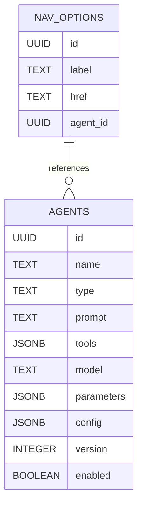

# LeaderForge Agent Architecture: Modular, Extensible, and Future-Proof

> **Note:** For up-to-date agent configuration patterns, see [Agent Configuration Guide](./agent-configuration-guide.md).

## Overview

This document describes the **modular agent architecture** for LeaderForge, supporting:
- Centralized agent definitions (prompts, tools, workflows, config)
- Clean separation between UI navigation and agent logic
- Support for both simple LLM agents and complex LangGraph automations
- Versioning, auditing, and future extensibility

---

## 1. Motivation

- **Old Pattern:**
  - `agent_prompts` table (or `agent_prompt` field on `core.nav_options`)
  - Tight coupling of UI navigation and agent logic
  - Difficult to manage, extend, or reuse agents

- **New Pattern:**
  - Dedicated `core.agents` table
  - All agent config (prompt, tools, workflow, model, etc.) in one place
  - `core.nav_options` references agents by `agent_id`
  - Supports both single-agent and multi-step (LangGraph) automations

---

## 2. Database Schema

### `core.agents` Table

```sql
CREATE TABLE core.agents (
  id UUID PRIMARY KEY DEFAULT gen_random_uuid(),
  name TEXT NOT NULL,
  display_name TEXT,
  type TEXT NOT NULL CHECK (type IN ('llm', 'langgraph', 'tool', 'workflow')),
  prompt TEXT,
  tools JSONB,         -- e.g., ["TribeSocialContentTool"]
  model TEXT,          -- e.g., "claude-3-opus"
  parameters JSONB,    -- e.g., {"temperature": 0.2}
  config JSONB,        -- Arbitrary config for LangGraph, etc.
  version INTEGER DEFAULT 1,
  enabled BOOLEAN DEFAULT true,
  created_at TIMESTAMPTZ DEFAULT NOW(),
  updated_at TIMESTAMPTZ DEFAULT NOW()
);
```

### `core.nav_options` Table (Reference)

```sql
ALTER TABLE core.nav_options
  ADD COLUMN agent_id UUID REFERENCES core.agents(id);
```

---

## 3. Agent Definition Example

| id (UUID) | name         | type      | prompt                | tools                        | model           | parameters           | config         | version | enabled |
|-----------|--------------|-----------|-----------------------|------------------------------|------------------|----------------------|----------------|---------|---------|
| ...       | libraryAgent | "llm"     | "You are the Content Discovery Agent..." | ["TribeSocialContentTool"] | "claude-3-opus" | {"temperature":0.2} | {}             | 1       | true    |
| ...       | progressAgent| "llm"     | "You are the Progress Tracker Agent..."  | []                         | "claude-3-opus" | {"temperature":0.1} | {}             | 1       | true    |
| ...       | teamInsights | "langgraph"| null                  | ["TeamAnalyticsTool"]        | null             | {}                   | {graphConfig}  | 1       | true    |

---

## 4. Agent Lookup and Invocation Flow

1. **User clicks a nav option** in the UI.
2. **Frontend** sends the nav option ID to the backend.
3. **Backend**:
   - Looks up the nav option in `core.nav_options`
   - Gets the `agent_id`
   - Loads the agent config from `core.agents`
   - Uses the agent config to:
     - Build the prompt
     - Select the model
     - Bind tools
     - (If type is `langgraph`, load the workflow config)
   - Invokes the agent (LLM or LangGraph)
   - Returns the structured response to the frontend

---

## 5. Why Not Just `agent_prompt` on Nav Option?

- **Duplication:** Multiple nav options may use the same agent logic.
- **Extensibility:** You'll want to add more config (tools, model, workflow, etc.) over time.
- **Separation of Concerns:** UI config (nav) should not contain agent logic.
- **Reusability:** Agents can be reused across nav options, chat, automations, etc.
- **Versioning:** Centralized agent table allows for versioning and audit.

---

## 6. Migration Plan

1. **Create `core.agents` table** (see schema above).
2. **Add `agent_id` to `core.nav_options`**.
3. **Migrate existing prompts/config from `agent_prompts` to `core.agents`**.
4. **Update all code to use agent lookup via `agent_id`**.
5. **Drop the old `agent_prompts` table** once migration is complete and verified.

---

## 7. Example: Content Library Agent

**Agent Row:**
| name         | type | prompt | tools                        | model           | parameters           |
|--------------|------|--------|------------------------------|------------------|----------------------|
| libraryAgent | llm  | "You are the Content Discovery Agent..." | ["TribeSocialContentTool"] | "claude-3-opus" | {"temperature":0.2} |

**Nav Option Row:**
| label                | href      | agent_id (FK) |
|----------------------|-----------|--------------|
| "Brilliant+ Library" | /library  | (UUID of libraryAgent) |

---

## 8. Extending for LangGraph and Multi-Agent

- Add a `type` column (`llm`, `langgraph`, etc.)
- Store LangGraph workflow config in the `config` JSONB column
- Add a `tools` array for tool orchestration
- Add `parameters` for model/tool config

---

## 9. Versioning and Audit

- Add `version` and `enabled` columns to `core.agents`
- Optionally, add an audit log or history table for agent changes

---

## 10. Example Query

```sql
-- Get agent config for a nav option
SELECT a.*
FROM core.nav_options n
JOIN core.agents a ON n.agent_id = a.id
WHERE n.id = $1;
```

---

## 11. Next Steps

1. **Implement the schema changes** (create `core.agents`, add `agent_id` to `core.nav_options`).
2. **Migrate data** from `agent_prompts` to `core.agents`.
3. **Update backend logic** to use agent lookup and config.
4. **Drop the old `agent_prompts` table**.
5. **Document agent creation and management for future devs/admins.

---

## 12. FAQ

**Q: Can an agent be used for both nav and chat?**
A: Yes! The agent is now a reusable, modular entity.

**Q: How do I add a new tool or workflow?**
A: Add it to the `tools` or `config` column in `core.agents`, and update the agent orchestration logic.

**Q: How do I version or disable an agent?**
A: Use the `version` and `enabled` columns.

---

## 13. Secure API/Tool Integration

### Where to Define Integrations
- **Agent Table:** Reference tool names (e.g., `tools: ["TribeSocialContentTool"]`) and non-secret config in `config`.
- **Tool Implementation:** Implemented in backend code, reads secrets from environment variables.

### Storing Credentials
- **Environment Variables:** Store all API keys/secrets in `.env` or your cloud secret manager. Never in the DB.
- **Tool Reads from Env:**
  ```ts
  const apiKey = process.env.TRIBE_SOCIAL_API_KEY;
  ```
- **Never in DB or Frontend:** Only reference tool names/config in DB.

### Security Best Practices
- Principle of least privilege: Only expose secrets to the backend process that needs them.
- Never store or expose API keys in the database or frontend.
- Rotate keys regularly; use secret manager in production.
- Log tool usage, but never log secrets.

### Example: Tribe Social Tool Integration

**Agent Table Row:**
| name         | tools                        | config (JSONB)                |
|--------------|-----------------------------|-------------------------------|
| libraryAgent | ["TribeSocialContentTool"]   | {"tribeSocial": {"resultLimit": 5}} |

**Tool Implementation:**
```ts
// agent-core/tools/TribeSocialContentTool.ts
export async function TribeSocialContentTool(query, config) {
  const apiKey = process.env.TRIBE_SOCIAL_API_KEY;
  const apiUrl = process.env.TRIBE_SOCIAL_API_URL;
  // ... use apiKey securely
}
```

**Agent Orchestration:**
- Loads agent config from DB
- Loads tool(s) by name from codebase
- Passes non-secret config from DB, secrets from env

### Summary Table
| What                | Where Stored         | Example/Notes                        |
|---------------------|---------------------|--------------------------------------|
| Tool name           | DB (core.agents)    | "TribeSocialContentTool"             |
| Tool config         | DB (core.agents)    | {"resultLimit": 5}                   |
| API endpoint        | DB or .env          | Prefer .env for flexibility          |
| API key/secret      | .env only           | Never in DB, never in frontend       |
| Tool implementation | Codebase            | Reads secrets from env at runtime    |

---

## 14. Diagram



---

## 15. Deprecation

- The `agent_prompts` table is deprecated and will be dropped after migration.

---

**This architecture is modular, future-proof, and supports both simple and advanced agent orchestration.**