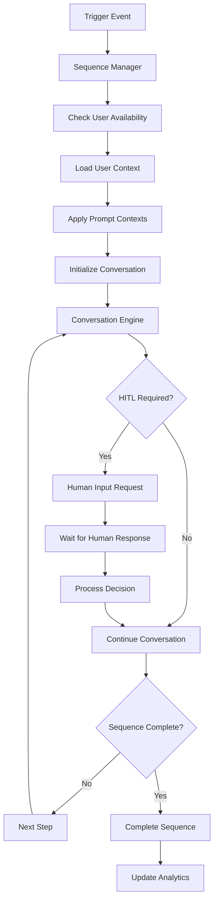
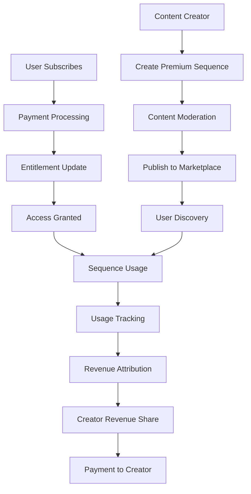

# PowerPrompts - Product Requirements Document

## Executive Summary

PowerPrompts transforms the traditional AI interaction model by enabling AI to proactively initiate conversations, guide user development, and execute complex workflows with human-in-the-loop oversight. This system creates a new paradigm where AI becomes a proactive coach, mentor, and assistant that drives user engagement and development through intelligent, contextual prompting sequences while generating sustainable revenue through subscription-based premium content.

## Document Information

- **Document Version**: 1.0
- **Last Updated**: [Current Date]
- **Author**: [Glen Hobbs]
- **Status**: Draft
- **Target Release**: Q3 2025

---

## Table of Contents

1. [Product Overview](#product-overview)
2. [User Personas & Access Scenarios](#user-personas--access-scenarios)
3. [Role-Based Access Control (RBAC)](#role-based-access-control-rbac)
4. [Functional Requirements](#functional-requirements)
5. [Technical Architecture](#technical-architecture)
6. [Database Schema](#database-schema)
7. [API Specifications](#api-specifications)
8. [Security & Privacy](#security--privacy)
9. [Integration Requirements](#integration-requirements)
10. [Revenue Model & Monetization](#revenue-model--monetization)
11. [Success Metrics](#success-metrics)
12. [Implementation Timeline](#implementation-timeline)

---

## Product Overview

### Purpose Statement
PowerPrompts creates a proactive AI ecosystem where artificial intelligence initiates meaningful conversations, guides user development through structured sequences, and executes complex workflows with strategic human intervention points, transforming passive AI tools into active development partners.

### Core Value Propositions
- **Proactive Development**: AI initiates development conversations rather than waiting for user prompts
- **Structured Growth**: Systematic progression through curated development sequences
- **Revenue Generation**: Subscription-based premium sequences create sustainable income streams
- **Community Ecosystem**: User-generated and expert-created content marketplace
- **Intelligent Automation**: HITL workflows that balance automation with human oversight

### Key Features
- AI-initiated conversation sequences with multiple trigger types
- Subscription-based premium content with tiered access
- Community marketplace for user-generated sequences
- Human-in-the-loop workflow integration
- Advanced scheduling and progression tracking
- Analytics and effectiveness measurement
- Integration with all LeaderForge features

### PowerPrompts Philosophy

**Traditional Model**: Human prompts AI → AI responds → Conversation ends
**PowerPrompts Model**: AI observes context → AI initiates conversation → Human responds → AI adapts and continues → Meaningful development occurs

---

## User Personas & Access Scenarios

### Primary Personas

#### 1. **Content Subscriber** (Individual Users)
**Access Needs**: Subscribe to premium sequences, track progress, customize scheduling
**Use Cases**: Personal development, skill building, leadership growth, habit formation
**Pain Points**: Want structured development but lack discipline for self-directed learning
**Revenue Impact**: Primary subscription revenue source

#### 2. **Sequence Creator** (Expert Contributors)
**Access Needs**: Create and monetize sequences, access analytics, manage content
**Use Cases**: Share expertise, build reputation, generate income, help community
**Pain Points**: Need platform to reach audience and monetize knowledge
**Revenue Impact**: Content creation drives platform value and user acquisition

#### 3. **Team Leader** (Managers, Coaches)
**Access Needs**: Assign sequences to team members, track team progress, create team-specific sequences
**Use Cases**: Team development, coaching automation, performance improvement, culture building
**Pain Points**: Need scalable way to provide consistent development guidance
**Revenue Impact**: Team subscriptions and enterprise features

#### 4. **Organization Administrator** (HR, Learning & Development)
**Access Needs**: Enterprise sequence management, organization-wide analytics, compliance tracking
**Use Cases**: Leadership development programs, onboarding sequences, culture reinforcement
**Pain Points**: Need to scale personalized development across large organizations
**Revenue Impact**: Enterprise contracts and bulk licensing

#### 5. **Community Moderator** (Platform Curators)
**Access Needs**: Content moderation, quality assurance, community management
**Use Cases**: Maintain content quality, prevent spam, curate featured content
**Pain Points**: Need efficient tools to manage growing content volume
**Revenue Impact**: Content quality drives user satisfaction and retention

### Access Scenarios

#### Scenario 1: New User Sequence Discovery
```
User: Individual Contributor exploring PowerPrompts
Action: First visit to PowerPrompts library
Expected Behavior:
- See personalized recommendations based on role and goals
- Access to free introductory sequences
- Clear preview of premium sequence benefits
- Simple subscription flow for premium access
- Immediate value demonstration through free content
```

#### Scenario 2: Enterprise Sequence Deployment
```
User: HR Administrator deploying leadership development sequence
Action: Assign 50-person cohort to 12-week leadership sequence
Expected Behavior:
- Bulk assignment interface with individual customization
- Progress tracking dashboard for all participants
- Automated reporting to stakeholders
- Integration with existing HR systems
- Compliance and completion tracking
```

#### Scenario 3: Creator Revenue Sharing
```
User: Expert creating premium sequence about conflict resolution
Action: Publishes sequence and sets pricing
Expected Behavior:
- Revenue sharing calculation (70% creator, 30% platform)
- Real-time analytics on subscriptions and usage
- Automatic payment processing
- Content performance insights
- Promotional tools for creators
```

#### Scenario 4: Team Development Campaign
```
User: Marketing Team Leader deploying creativity sequence
Action: Assigns team to "Creative Leadership" sequence
Expected Behavior:
- Team-specific customization of sequence content
- Collaborative elements for team discussion
- Integration with team's existing workflows
- Progress visibility for team members
- Success celebration and recognition
```

---

## Role-Based Access Control (RBAC)

### Permission Matrix

| Feature | Guest | Individual | Team Member | Team Leader | Creator | Enterprise Admin | Sys Admin |
|---------|--------|------------|-------------|-------------|---------|------------------|-----------|
| **SEQUENCE ACCESS** | | | | | | | |
| Free sequences | ✅ | ✅ | ✅ | ✅ | ✅ | ✅ | ✅ |
| Premium sequences | Preview | Subscribed | Subscribed | Subscribed | Own + Subscribed | All | All |
| Enterprise sequences | ❌ | ❌ | If assigned | If assigned | ❌ | All | All |
| Beta sequences | ❌ | Opt-in | Opt-in | Opt-in | ✅ | ✅ | ✅ |
| **SEQUENCE MANAGEMENT** | | | | | | | |
| Subscribe to sequences | ❌ | ✅ | ✅ | ✅ | ✅ | ✅ | ✅ |
| Pause/resume sequences | ❌ | Own only | Own only | Own + Assigned | Own + Created | All assigned | All |
| Customize scheduling | ❌ | ✅ | ✅ | ✅ | ✅ | ✅ | ✅ |
| Track progress | ❌ | Own only | Own only | Own + Team | Own + Created | Organization | All |
| **CONTENT CREATION** | | | | | | | |
| Create personal sequences | ❌ | ✅ | ✅ | ✅ | ✅ | ✅ | ✅ |
| Create team sequences | ❌ | ❌ | ❌ | ✅ | ✅ | ✅ | ✅ |
| Create premium sequences | ❌ | Apply | Apply | Apply | ✅ | ❌ | ✅ |
| Create enterprise sequences | ❌ | ❌ | ❌ | ❌ | Partner only | ✅ | ✅ |
| **ASSIGNMENT & DEPLOYMENT** | | | | | | | |
| Assign to individuals | ❌ | ❌ | ❌ | Team members | ❌ | Organization | All |
| Assign to teams | ❌ | ❌ | ❌ | Own teams | ❌ | All teams | All |
| Bulk assignments | ❌ | ❌ | ❌ | Limited | ❌ | ✅ | ✅ |
| Mandatory assignments | ❌ | ❌ | ❌ | ❌ | ❌ | ✅ | ✅ |
| **ANALYTICS & REPORTING** | | | | | | | |
| Personal analytics | ❌ | ✅ | ✅ | ✅ | ✅ | ✅ | ✅ |
| Team analytics | ❌ | ❌ | ❌ | Own teams | Created content | All teams | All |
| Creator analytics | ❌ | ❌ | ❌ | ❌ | ✅ | ❌ | ✅ |
| Revenue analytics | ❌ | ❌ | ❌ | ❌ | Own content | Summary | All |
| Organization analytics | ❌ | ❌ | ❌ | ❌ | ❌ | ✅ | ✅ |
| **MODERATION & ADMIN** | | | | | | | |
| Flag inappropriate content | ❌ | ✅ | ✅ | ✅ | ✅ | ✅ | ✅ |
| Moderate submissions | ❌ | ❌ | ❌ | ❌ | ❌ | Limited | ✅ |
| Approve/reject content | ❌ | ❌ | ❌ | ❌ | ❌ | Limited | ✅ |
| Manage revenue sharing | ❌ | ❌ | ❌ | ❌ | ❌ | ❌ | ✅ |
| Platform configuration | ❌ | ❌ | ❌ | ❌ | ❌ | ❌ | ✅ |

### Subscription Tiers & Entitlements

#### Individual Subscriptions
```typescript
interface IndividualSubscriptionTiers {
  free: {
    maxActiveSequences: 2;
    accessToFreeSequences: true;
    accessToPremiumSequences: false;
    canCreatePersonalSequences: true;
    maxPersonalSequences: 3;
    analyticsAccess: 'basic';
    supportLevel: 'community';
  };
  
  premium: {
    maxActiveSequences: 10;
    accessToFreeSequences: true;
    accessToPremiumSequences: true;
    canCreatePersonalSequences: true;
    maxPersonalSequences: 25;
    canCreatePublicSequences: false;
    analyticsAccess: 'advanced';
    supportLevel: 'email';
    price: '$19/month';
  };
  
  creator: {
    maxActiveSequences: 25;
    accessToFreeSequences: true;
    accessToPremiumSequences: true;
    canCreatePersonalSequences: true;
    maxPersonalSequences: 100;
    canCreatePublicSequences: true;
    canMonetizeSequences: true;
    revenueShare: 70; // 70% to creator, 30% to platform
    analyticsAccess: 'creator';
    supportLevel: 'priority';
    price: '$49/month';
  };
}
```

#### Team & Enterprise Subscriptions
```typescript
interface EnterpriseSubscriptionTiers {
  team: {
    minUsers: 5;
    maxUsers: 50;
    maxActiveSequencesPerUser: 15;
    accessToAllFreeAndPremiumSequences: true;
    canCreateTeamSequences: true;
    canAssignSequencesToTeamMembers: true;
    teamAnalytics: true;
    bulkAssignment: 'limited';
    integrationSupport: 'basic';
    supportLevel: 'business';
    pricePerUser: '$12/month';
  };
  
  enterprise: {
    minUsers: 51;
    maxUsers: 'unlimited';
    maxActiveSequencesPerUser: 'unlimited';
    accessToAllSequences: true;
    canCreateEnterpriseSequences: true;
    canCreateMandatorySequences: true;
    bulkAssignment: 'unlimited';
    organizationAnalytics: true;
    complianceReporting: true;
    ssoIntegration: true;
    apiAccess: true;
    customBranding: true;
    dedicatedSupport: true;
    pricePerUser: '$25/month';
  };
}
```

### Dynamic Permission Resolution
```typescript
interface PowerPromptsPermissionResolver {
  // Check sequence access
  async canAccessSequence(userId: string, sequenceId: string): Promise<AccessResult> {
    const sequence = await this.getSequence(sequenceId);
    const userSubscription = await this.getUserSubscription(userId);
    
    // Check subscription tier access
    if (sequence.isPremium && !userSubscription.accessToPremiumSequences) {
      return { 
        allowed: false, 
        reason: 'PREMIUM_SUBSCRIPTION_REQUIRED',
        upgradeOptions: this.getUpgradeOptions(userSubscription)
      };
    }
    
    // Check enterprise sequence access
    if (sequence.isEnterprise) {
      const hasEnterpriseAccess = await this.checkEnterpriseAccess(userId, sequence);
      return { 
        allowed: hasEnterpriseAccess,
        reason: hasEnterpriseAccess ? null : 'ENTERPRISE_ACCESS_REQUIRED'
      };
    }
    
    // Check team assignment
    if (sequence.visibility === 'team') {
      const isTeamMember = await this.checkTeamMembership(userId, sequence.teamId);
      return { allowed: isTeamMember };
    }
    
    return { allowed: true };
  }
  
  // Check creation permissions
  async canCreateSequence(
    userId: string, 
    sequenceType: SequenceType
  ): Promise<CreationPermissionResult> {
    const userSubscription = await this.getUserSubscription(userId);
    const currentUsage = await this.getUserSequenceUsage(userId);
    
    switch (sequenceType) {
      case 'personal':
        return {
          allowed: currentUsage.personalSequences < userSubscription.maxPersonalSequences,
          remainingQuota: userSubscription.maxPersonalSequences - currentUsage.personalSequences
        };
        
      case 'premium':
        return {
          allowed: userSubscription.canCreatePublicSequences && userSubscription.canMonetizeSequences,
          upgradeRequired: !userSubscription.canCreatePublicSequences
        };
        
      case 'enterprise':
        const hasEnterpriseRole = await this.checkRole(userId, 'enterprise_admin');
        return { allowed: hasEnterpriseRole };
        
      default:
        return { allowed: false, reason: 'INVALID_SEQUENCE_TYPE' };
    }
  }
}
```

---

## Functional Requirements

### Core Features

#### 1. Sequence Creation & Management

**FR-001: Sequence Builder Interface**
- Drag-and-drop sequence builder with visual flow design
- Multi-step prompt creation with branching logic
- Template library with pre-built sequence patterns
- Real-time preview and testing capabilities
- Version control with change tracking and rollback

**FR-002: Sequence Configuration**
- Flexible scheduling options (time-based, event-triggered, completion-based)
- Customizable progression rules and prerequisites
- Adaptive pacing based on user engagement and performance
- Multi-media content support (text, video, audio, interactive elements)
- Localization and multi-language support

**FR-003: Sequence Types & Categories**
- **Leadership Development**: Executive coaching, team management, strategic thinking
- **Skill Building**: Communication, conflict resolution, presentation skills
- **Personal Growth**: Habits, mindfulness, work-life balance, goal setting
- **Business Operations**: Sales, marketing, customer service, project management
- **Onboarding & Training**: Role-specific training, company culture, compliance
- **Custom Categories**: User-defined categories for specialized content

#### 2. Subscription & Monetization

**FR-004: Subscription Management**
- Flexible subscription tiers with clear feature differentiation
- Free trial periods and freemium model support
- Team and enterprise bulk purchasing options
- Automatic billing and payment processing integration
- Subscription analytics and churn prevention

**FR-005: Creator Revenue Sharing**
- Transparent revenue sharing model (70% creator, 30% platform)
- Real-time earnings tracking and analytics
- Multiple payment methods and international support
- Tax reporting and compliance documentation
- Creator incentive programs and bonuses

**FR-006: Content Marketplace**
- Sequence discovery with advanced search and filtering
- User ratings and reviews system
- Featured content and editorial curation
- Trending and popular sequence tracking
- Social proof and community recommendations

#### 3. Sequence Execution & Interaction

**FR-007: AI-Initiated Conversations**
- Context-aware timing for sequence initiation
- Natural language conversation flows
- Adaptive questioning based on user responses
- Emotional intelligence and empathy modeling
- Multi-turn conversation memory and context

**FR-008: Human-in-the-Loop Integration**
- Strategic pause points for human reflection and decision-making
- Approval workflows for significant actions or commitments
- Escalation triggers for complex situations requiring human intervention
- Collaborative decision-making between AI and user
- Learning from human feedback to improve future interactions

**FR-009: Progress Tracking & Adaptation**
- Real-time progress monitoring and milestone tracking
- Adaptive content delivery based on user performance
- Personalized pacing and difficulty adjustment
- Learning path optimization using machine learning
- Goal achievement tracking and celebration

#### 4. Team & Enterprise Features

**FR-010: Team Collaboration**
- Team-wide sequence assignments with individual tracking
- Collaborative sequence creation and editing
- Team discussion forums and peer support
- Shared goal setting and accountability partnerships
- Team performance analytics and insights

**FR-011: Enterprise Administration**
- Bulk user management and sequence assignment
- Organization-wide analytics and reporting
- Compliance tracking and audit trails
- Integration with HR systems and learning management platforms
- Custom branding and white-label options

**FR-012: Advanced Analytics**
- Individual progress analytics with actionable insights
- Team performance metrics and comparative analysis
- Sequence effectiveness measurement and optimization
- ROI calculation for enterprise deployments
- Predictive analytics for completion and success rates

### Integration Features

#### 5. Platform Integration

**FR-013: CopilotKit Integration**
- Seamless transition from PowerPrompts to CopilotKit conversations
- Shared context and conversation history
- PowerPrompt-initiated CopilotKit sessions
- Content panel integration for sequence outputs
- Cross-feature analytics and user journey tracking

**FR-014: Prompt Context Integration**
- Automatic application of user's prompt contexts to sequence interactions
- Context-aware sequence recommendations
- Dynamic sequence adaptation based on active contexts
- Context effectiveness measurement within sequences
- Sequence-specific context overrides and customizations

#### 6. External System Integration

**FR-015: Calendar & Scheduling Integration**
- Calendar-based sequence scheduling and reminders
- Meeting integration for team sequence discussions
- Time zone awareness and global scheduling support
- Conflict detection and automatic rescheduling
- Integration with popular calendar applications

**FR-016: Communication Platform Integration**
- Slack and Microsoft Teams integration for sequence notifications
- Email automation for sequence updates and reminders
- SMS and mobile push notifications
- Social media sharing for achievements and milestones
- Integration with existing communication workflows

---

## Technical Architecture

### System Components

#### PowerPrompts Engine Architecture
```typescript
interface PowerPromptsEngine {
  sequenceManager: SequenceManager;
  conversationEngine: ConversationEngine;
  schedulingService: SchedulingService;
  analyticsEngine: AnalyticsEngine;
  subscriptionManager: SubscriptionManager;
  contentDelivery: ContentDeliveryNetwork;
}

interface SequenceManager {
  // Sequence lifecycle management
  createSequence(sequence: SequenceDefinition): Promise<string>;
  updateSequence(sequenceId: string, updates: SequenceUpdate): Promise<void>;
  deleteSequence(sequenceId: string): Promise<void>;
  
  // Sequence execution
  initiateSequence(userId: string, sequenceId: string): Promise<SequenceInstance>;
  progressSequence(instanceId: string, userResponse: UserResponse): Promise<NextStep>;
  pauseSequence(instanceId: string): Promise<void>;
  resumeSequence(instanceId: string): Promise<void>;
  
  // Sequence optimization
  analyzeSequenceEffectiveness(sequenceId: string): Promise<EffectivenessReport>;
  suggestSequenceOptimizations(sequenceId: string): Promise<OptimizationSuggestion[]>;
}
```

#### Conversation Engine Architecture
```typescript
interface ConversationEngine {
  // AI conversation management
  initiateConversation(
    userId: string,
    sequenceStep: SequenceStep,
    userContext: UserContext
  ): Promise<ConversationSession>;
  
  processUserResponse(
    sessionId: string,
    userResponse: string
  ): Promise<AIResponse>;
  
  // HITL integration
  requestHumanInput(
    sessionId: string,
    context: HITLContext
  ): Promise<HITLRequest>;
  
  processHumanDecision(
    sessionId: string,
    decision: HumanDecision
  ): Promise<ConversationContinuation>;
  
  // Context integration
  applyPromptContexts(
    conversation: ConversationSession,
    contexts: PromptContext[]
  ): ConversationSession;
}
```

### Data Flow Architecture

#### Sequence Execution Flow


#### Subscription & Revenue Flow


### Performance & Scalability

#### Sequence Distribution System
```typescript
interface SequenceDistributionSystem {
  // Load balancing for sequence execution
  distributeSequenceLoad(activeSequences: SequenceInstance[]): LoadDistribution;
  
  // Caching strategy for sequence content
  cacheSequenceContent(sequenceId: string, content: SequenceContent): Promise<void>;
  invalidateSequenceCache(sequenceId: string): Promise<void>;
  
  // Geographic distribution
  getOptimalRegion(userId: string): Promise<Region>;
  replicateSequenceContent(sequenceId: string, regions: Region[]): Promise<void>;
}
```

#### Real-Time Conversation Management
```typescript
interface RealTimeConversationManager {
  // WebSocket connections for real-time interactions
  establishConnection(userId: string): WebSocketConnection;
  
  // Message queuing for reliable delivery
  queueMessage(userId: string, message: PowerPromptMessage): Promise<void>;
  processMessageQueue(userId: string): Promise<ProcessedMessage[]>;
  
  // Conversation state management
  saveConversationState(sessionId: string, state: ConversationState): Promise<void>;
  loadConversationState(sessionId: string): Promise<ConversationState>;
  
  // Failover and recovery
  handleConnectionFailure(userId: string): Promise<void>;
  recoverConversationSession(sessionId: string): Promise<ConversationSession>;
}
```

---

## Database Schema

### Core Sequence Tables

#### Sequences Table
```sql
CREATE TABLE sequences (
    id UUID PRIMARY KEY,
    title VARCHAR(255) NOT NULL,
    description TEXT,
    category VARCHAR(100) NOT NULL,
    tags VARCHAR(50)[],
    
    -- Content and structure
    sequence_data JSONB NOT NULL, -- Full sequence definition
    estimated_duration_days INTEGER,
    difficulty_level VARCHAR(20) CHECK (difficulty_level IN ('beginner', 'intermediate', 'advanced', 'expert')),
    total_steps INTEGER NOT NULL,
    
    -- Creator and ownership
    creator_id UUID REFERENCES users(id),
    organization_id UUID REFERENCES organizations(id),
    team_id UUID REFERENCES teams(id),
    
    -- Visibility and access
    visibility VARCHAR(20) NOT NULL CHECK (visibility IN ('public', 'premium', 'team', 'organization', 'private')),
    is_premium BOOLEAN DEFAULT FALSE,
    is_enterprise BOOLEAN DEFAULT FALSE,
    is_featured BOOLEAN DEFAULT FALSE,
    
    -- Pricing and monetization
    price_cents INTEGER DEFAULT 0,
    revenue_share_percentage INTEGER DEFAULT 70,
    currency VARCHAR(3) DEFAULT 'USD',
    
    -- Status and lifecycle
    status VARCHAR(20) DEFAULT 'draft' CHECK (status IN ('draft', 'published', 'archived', 'suspended')),
    moderation_status VARCHAR(20) DEFAULT 'pending' CHECK (moderation_status IN ('pending', 'approved', 'rejected', 'flagged')),
    version INTEGER DEFAULT 1,
    
    -- Analytics and performance
    total_subscribers INTEGER DEFAULT 0,
    total_completions INTEGER DEFAULT 0,
    average_rating DECIMAL(3,2) DEFAULT 0,
    completion_rate DECIMAL(5,2) DEFAULT 0,
    
    -- Metadata
    created_at TIMESTAMP DEFAULT NOW(),
    updated_at TIMESTAMP DEFAULT NOW(),
    published_at TIMESTAMP,
    created_by UUID REFERENCES users(id),
    updated_by UUID REFERENCES users(id)
);

-- Indexes for performance
CREATE INDEX idx_sequences_creator ON sequences(creator_id);
CREATE INDEX idx_sequences_category ON sequences(category);
CREATE INDEX idx_sequences_visibility ON sequences(visibility);
CREATE INDEX idx_sequences_status ON sequences(status);
CREATE INDEX idx_sequences_premium ON sequences(is_premium);
CREATE INDEX idx_sequences_featured ON sequences(is_featured);
CREATE INDEX idx_sequences_tags ON sequences USING GIN(tags);
CREATE INDEX idx_sequences_rating ON sequences(average_rating DESC);
```

#### Sequence Subscriptions Table
```sql
CREATE TABLE sequence_subscriptions (
    id UUID PRIMARY KEY,
    user_id UUID REFERENCES users(id) ON DELETE CASCADE,
    sequence_id UUID REFERENCES sequences(id) ON DELETE CASCADE,
    
    -- Subscription details
    subscription_type VARCHAR(20) NOT NULL CHECK (subscription_type IN ('individual', 'team', 'enterprise')),
    assigned_by UUID REFERENCES users(id), -- NULL for self-subscriptions
    
    -- Billing and payment
    payment_id VARCHAR(255), -- External payment system ID
    amount_paid_cents INTEGER,
    currency VARCHAR(3) DEFAULT 'USD',
    
    -- Status and lifecycle
    status VARCHAR(20) DEFAULT 'active' CHECK (status IN ('active', 'paused', 'completed', 'cancelled', 'expired')),
    
    -- Progress tracking
    current_step INTEGER DEFAULT 0,
    total_steps_completed INTEGER DEFAULT 0,
    progress_percentage DECIMAL(5,2) DEFAULT 0,
    last_interaction_at TIMESTAMP,
    
    -- Scheduling and preferences
    preferred_time TIME,
    preferred_timezone VARCHAR(50),
    preferred_days INTEGER[], -- Array of day numbers (1=Monday, 7=Sunday)
    pause_until TIMESTAMP,
    
    -- Completion tracking
    started_at TIMESTAMP,
    completed_at TIMESTAMP,
    estimated_completion_date DATE,
    
    -- Audit fields
    created_at TIMESTAMP DEFAULT NOW(),
    updated_at TIMESTAMP DEFAULT NOW(),
    
    UNIQUE(user_id, sequence_id)
);

CREATE INDEX idx_sequence_subscriptions_user ON sequence_subscriptions(user_id);
CREATE INDEX idx_sequence_subscriptions_sequence ON sequence_subscriptions(sequence_id);
CREATE INDEX idx_sequence_subscriptions_status ON sequence_subscriptions(status);
CREATE INDEX idx_sequence_subscriptions_active ON sequence_subscriptions(status) WHERE status = 'active';
```

#### Sequence Instances Table
```sql
CREATE TABLE sequence_instances (
    id UUID PRIMARY KEY,
    subscription_id UUID REFERENCES sequence_subscriptions(id) ON DELETE CASCADE,
    user_id UUID REFERENCES users(id),
    sequence_id UUID REFERENCES sequences(id),
    
    -- Instance state
    current_step INTEGER NOT NULL DEFAULT 1,
    instance_data JSONB, -- User-specific data and variables
    conversation_history JSONB[], -- Array of conversation sessions
    
    -- Execution context
    prompt_contexts JSONB, -- Active prompt contexts during execution
    user_preferences JSONB, -- Instance-specific user preferences
    
    -- Status and timing
    status VARCHAR(20) DEFAULT 'active' CHECK (status IN ('active', 'paused', 'waiting_human', 'completed', 'failed')),
    next_trigger_at TIMESTAMP,
    last_executed_at TIMESTAMP,
    
    -- HITL state
    pending_human_action JSONB, -- Details of required human input
    human_action_deadline TIMESTAMP,
    
    -- Performance tracking
    execution_time_ms INTEGER,
    ai_response_quality_scores DECIMAL(3,2)[],
    user_satisfaction_scores INTEGER[],
    
    created_at TIMESTAMP DEFAULT NOW(),
    updated_at TIMESTAMP DEFAULT NOW()
);

CREATE INDEX idx_sequence_instances_subscription ON sequence_instances(subscription_id);
CREATE INDEX idx_sequence_instances_user ON sequence_instances(user_id);
CREATE INDEX idx_sequence_instances_status ON sequence_instances(status);
CREATE INDEX idx_sequence_instances_next_trigger ON sequence_instances(next_trigger_at);
CREATE INDEX idx_sequence_instances_pending_human ON sequence_instances(status) WHERE status = 'waiting_human';
```

### Subscription & Revenue Tables

#### User Subscriptions Table
```sql
CREATE TABLE user_subscriptions (
    id UUID PRIMARY KEY,
    user_id UUID REFERENCES users(id) ON DELETE CASCADE,
    
    -- Subscription details
    subscription_tier VARCHAR(20) NOT NULL CHECK (subscription_tier IN ('free', 'premium', 'creator', 'team', 'enterprise')),
    external_subscription_id VARCHAR(255), -- Stripe/payment processor ID
    
    -- Billing
    amount_cents INTEGER NOT NULL,
    currency VARCHAR(3) DEFAULT 'USD',
    billing_cycle VARCHAR(20) DEFAULT 'monthly' CHECK (billing_cycle IN ('monthly', 'yearly', 'lifetime')),
    
    -- Status and lifecycle
    status VARCHAR(20) DEFAULT 'active' CHECK (status IN ('active', 'past_due', 'cancelled', 'suspended', 'trial')),
    trial_end_date DATE,
    current_period_start DATE NOT NULL,
    current_period_end DATE NOT NULL,
    cancel_at_period_end BOOLEAN DEFAULT FALSE,
    
    -- Entitlements
    entitlements JSONB NOT NULL, -- Subscription tier entitlements
    
    -- Usage tracking
    current_usage JSONB, -- Current period usage stats
    
    created_at TIMESTAMP DEFAULT NOW(),
    updated_at TIMESTAMP DEFAULT NOW(),
    cancelled_at TIMESTAMP,
    
    UNIQUE(user_id, subscription_tier)
);

CREATE INDEX idx_user_subscriptions_user ON user_subscriptions(user_id);
CREATE INDEX idx_user_subscriptions_status ON user_subscriptions(status);
CREATE INDEX idx_user_subscriptions_external_id ON user_subscriptions(external_subscription_id);
```

#### Creator Revenue Table
```sql
CREATE TABLE creator_revenue (
    id UUID PRIMARY KEY,
    creator_id UUID REFERENCES users(id),
    sequence_id UUID REFERENCES sequences(id),
    subscription_id UUID REFERENCES sequence_subscriptions(id),
    
    -- Revenue details
    gross_amount_cents INTEGER NOT NULL,
    creator_share_percentage INTEGER NOT NULL,
    creator_amount_cents INTEGER NOT NULL,
    platform_amount_cents INTEGER NOT NULL,
    currency VARCHAR(3) DEFAULT 'USD',
    
    -- Payment processing
    payment_processor VARCHAR(50), -- stripe, paypal, etc.
    processor_fee_cents INTEGER DEFAULT 0,
    net_creator_amount_cents INTEGER NOT NULL,
    
    -- Status and timing
    status VARCHAR(20) DEFAULT 'pending' CHECK (status IN ('pending', 'processed', 'paid', 'failed')),
    earned_at TIMESTAMP NOT NULL,
    processed_at TIMESTAMP,
    paid_at TIMESTAMP,
    
    -- Payout details
    payout_batch_id VARCHAR(255),
    payout_method VARCHAR(50),
    
    created_at TIMESTAMP DEFAULT NOW()
);

CREATE INDEX idx_creator_revenue_creator ON creator_revenue(creator_id);
CREATE INDEX idx_creator_revenue_sequence ON creator_revenue(sequence_id);
CREATE INDEX idx_creator_revenue_status ON creator_revenue(status);
CREATE INDEX idx_creator_revenue_earned_at ON creator_revenue(earned_at);
```

### Analytics Tables

#### Sequence Analytics Table
```sql
CREATE TABLE sequence_analytics (
    id UUID PRIMARY KEY,
    sequence_id UUID REFERENCES sequences(id),
    user_id UUID REFERENCES users(id),
    subscription_id UUID REFERENCES sequence_subscriptions(id),
    
    -- Event details
    event_type VARCHAR(50) NOT NULL, -- started, step_completed, paused, resumed, completed, abandoned
    step_number INTEGER,
    event_data JSONB,
    
    -- Context
    conversation_session_id UUID,
    user_agent TEXT,
    device_type VARCHAR(20),
    
    -- Performance metrics
    response_time_ms INTEGER,
    ai_quality_score DECIMAL(3,2),
    user_satisfaction_rating INTEGER CHECK (user_satisfaction_rating BETWEEN 1 AND 5),
    
    -- Engagement metrics
    time_spent_seconds INTEGER,
    interaction_count INTEGER,
    follow_up_questions INTEGER,
    
    created_at TIMESTAMP DEFAULT NOW()
);

CREATE INDEX idx_sequence_analytics_sequence ON sequence_analytics(sequence_id);
CREATE INDEX idx_sequence_analytics_user ON sequence_analytics(user_id);
CREATE INDEX idx_sequence_analytics_event_type ON sequence_analytics(event_type);
CREATE INDEX idx_sequence_analytics_created_at ON sequence_analytics(created_at);
```

#### Sequence Performance Metrics Table
```sql
CREATE TABLE sequence_performance_metrics (
    id UUID PRIMARY KEY,
    sequence_id UUID REFERENCES sequences(id),
    
    -- Time period
    period_start TIMESTAMP NOT NULL,
    period_end TIMESTAMP NOT NULL,
    period_type VARCHAR(20) DEFAULT 'daily' CHECK (period_type IN ('hourly', 'daily', 'weekly', 'monthly')),
    
    -- Subscription metrics
    new_subscriptions INTEGER DEFAULT 0,
    cancelled_subscriptions INTEGER DEFAULT 0,
    active_subscriptions INTEGER DEFAULT 0,
    
    -- Engagement metrics
    total_interactions INTEGER DEFAULT 0,
    unique_active_users INTEGER DEFAULT 0,
    average_session_duration_seconds INTEGER DEFAULT 0,
    
    -- Completion metrics
    sequences_started INTEGER DEFAULT 0,
    sequences_completed INTEGER DEFAULT 0,
    completion_rate DECIMAL(5,2) DEFAULT 0,
    average_completion_time_days DECIMAL(5,2) DEFAULT 0,
    
    -- Quality metrics
    average_satisfaction_rating DECIMAL(3,2) DEFAULT 0,
    average_ai_quality_score DECIMAL(3,2) DEFAULT 0,
    support_tickets_created INTEGER DEFAULT 0,
    
    -- Revenue metrics
    gross_revenue_cents INTEGER DEFAULT 0,
    creator_revenue_cents INTEGER DEFAULT 0,
    platform_revenue_cents INTEGER DEFAULT 0,
    
    created_at TIMESTAMP DEFAULT NOW(),
    
    UNIQUE(sequence_id, period_start, period_end, period_type)
);
```

---

## API Specifications

### REST API Endpoints

#### Sequence Management API

```typescript
// GET /api/sequences
interface GetSequencesRequest {
  category?: string;
  tags?: string[];
  difficulty?: DifficultyLevel;
  visibility?: VisibilityLevel;
  isPremium?: boolean;
  creatorId?: string;
  search?: string;
  sort?: 'popular' | 'recent' | 'rating' | 'completion_rate';
  page?: number;
  limit?: number;
}

interface GetSequencesResponse {
  sequences: Sequence[];
  totalCount: number;
  filters: {
    categories: string[];
    tags: string[];
    creators: Creator[];
  };
  featured: Sequence[];
}

// GET /api/sequences/{id}
interface GetSequenceResponse {
  sequence: Sequence;
  permissions: SequencePermissions;
  subscription: SequenceSubscription | null;
  analytics: SequenceAnalyticsSummary;
  creator: Creator;
  relatedSequences: Sequence[];
}

// POST /api/sequences
interface CreateSequenceRequest {
  title: string;
  description: string;
  category: string;
  tags: string[];
  sequenceData: SequenceDefinition;
  visibility: VisibilityLevel;
  isPremium: boolean;
  priceCents?: number;
  estimatedDurationDays: number;
  difficultyLevel: DifficultyLevel;
}

interface CreateSequenceResponse {
  sequence: Sequence;
  success: boolean;
  validationErrors?: ValidationError[];
  moderationRequired: boolean;
}

// PUT /api/sequences/{id}
interface UpdateSequenceRequest {
  title?: string;
  description?: string;
  sequenceData?: SequenceDefinition;
  tags?: string[];
  priceCents?: number;
  changeSummary?: string;
}

// DELETE /api/sequences/{id}
interface DeleteSequenceRequest {
  reason?: string;
  transferSubscribers?: boolean;
  newSequenceId?: string;
}
```

#### Subscription Management API

```typescript
// POST /api/sequences/{id}/subscribe
interface SubscribeToSequenceRequest {
  subscriptionType: 'individual' | 'team' | 'enterprise';
  paymentMethodId?: string; // For premium sequences
  schedulingPreferences: SchedulingPreferences;
  teamMembers?: string[]; // For team subscriptions
}

interface SubscribeToSequenceResponse {
  subscription: SequenceSubscription;
  paymentIntent?: PaymentIntent; // For premium sequences
  estimatedStartDate: string;
  success: boolean;
}

// GET /api/users/{userId}/subscriptions
interface GetUserSubscriptionsResponse {
  active: SequenceSubscription[];
  completed: SequenceSubscription[];
  paused: SequenceSubscription[];
  entitlements: SubscriptionEntitlements;
  usageStats: UsageStatistics;
}

// PUT /api/subscriptions/{id}/pause
interface PauseSubscriptionRequest {
  pauseUntil?: string; // ISO date
  reason?: string;
}

// PUT /api/subscriptions/{id}/resume
interface ResumeSubscriptionRequest {
  newSchedule?: SchedulingPreferences;
}

// DELETE /api/subscriptions/{id}/cancel
interface CancelSubscriptionRequest {
  reason: string;
  feedback?: string;
  effectiveDate?: string; // Immediate or end of period
}
```

#### Sequence Execution API

```typescript
// POST /api/sequences/{id}/execute
interface ExecuteSequenceStepRequest {
  instanceId: string;
  userResponse?: string;
  userAction?: UserAction;
  contextOverrides?: ContextOverride[];
}

interface ExecuteSequenceStepResponse {
  nextStep: SequenceStep;
  aiResponse: AIResponse;
  conversationSession: ConversationSession;
  hitlRequired: boolean;
  hitlContext?: HITLContext;
  estimatedNextTrigger: string;
}

// POST /api/sequences/instances/{id}/human-input
interface ProvideHumanInputRequest {
  decision: HumanDecision;
  reasoning?: string;
  additionalContext?: any;
}

interface ProvideHumanInputResponse {
  continuationStep: SequenceStep;
  aiResponse: AIResponse;
  sequenceProgression: ProgressUpdate;
}

// GET /api/sequences/instances/{id}/status
interface GetInstanceStatusResponse {
  instance: SequenceInstance;
  currentStep: SequenceStep;
  progress: ProgressSummary;
  nextScheduledAction: ScheduledAction;
  recentConversations: ConversationSummary[];
}
```

#### Analytics API

```typescript
// GET /api/sequences/{id}/analytics
interface GetSequenceAnalyticsRequest {
  startDate?: string;
  endDate?: string;
  granularity?: 'day' | 'week' | 'month';
  metrics?: string[];
  segmentBy?: 'user_type' | 'subscription_tier' | 'device_type';
}

interface GetSequenceAnalyticsResponse {
  sequence: Sequence;
  period: DateRange;
  metrics: {
    subscriptions: SubscriptionMetrics;
    engagement: EngagementMetrics;
    completion: CompletionMetrics;
    revenue: RevenueMetrics;
    quality: QualityMetrics;
  };
  trends: TrendAnalysis;
  insights: AnalyticsInsight[];
}

// GET /api/creators/{id}/analytics
interface GetCreatorAnalyticsResponse {
  creator: Creator;
  summary: {
    totalSequences: number;
    totalSubscribers: number;
    totalRevenue: number;
    averageRating: number;
  };
  sequences: SequencePerformance[];
  revenue: RevenueBreakdown;
  engagement: CreatorEngagementMetrics;
  growth: GrowthMetrics;
}

// POST /api/analytics/sequence-interaction
interface TrackSequenceInteractionRequest {
  instanceId: string;
  interactionType: InteractionType;
  stepNumber: number;
  responseTime: number;
  userSatisfaction?: number;
  additionalData?: any;
}
```

### GraphQL Schema

```graphql
type Sequence {
  id: ID!
  title: String!
  description: String
  category: String!
  tags: [String!]!
  
  # Content
  sequenceData: JSON!
  estimatedDurationDays: Int!
  difficultyLevel: DifficultyLevel!
  totalSteps: Int!
  
  # Creator and ownership
  creator: User!
  organization: Organization
  team: Team
  
  # Visibility and access
  visibility: VisibilityLevel!
  isPremium: Boolean!
  isEnterprise: Boolean!
  isFeatured: Boolean!
  
  # Pricing
  priceCents: Int!
  currency: String!
  
  # Status
  status: SequenceStatus!
  moderationStatus: ModerationStatus!
  version: Int!
  
  # Analytics
  totalSubscribers: Int!
  totalCompletions: Int!
  averageRating: Float!
  completionRate: Float!
  
  # Timestamps
  createdAt: DateTime!
  updatedAt: DateTime!
  publishedAt: DateTime
  
  # Computed fields
  permissions: SequencePermissions!
  subscription: SequenceSubscription
  canSubscribe: Boolean!
  analytics: SequenceAnalytics!
}

type SequenceSubscription {
  id: ID!
  user: User!
  sequence: Sequence!
  
  subscriptionType: SubscriptionType!
  assignedBy: User
  
  status: SubscriptionStatus!
  currentStep: Int!
  progressPercentage: Float!
  
  schedulingPreferences: SchedulingPreferences!
  
  startedAt: DateTime
  completedAt: DateTime
  estimatedCompletionDate: Date
  
  instance: SequenceInstance
}

type SequenceInstance {
  id: ID!
  subscription: SequenceSubscription!
  
  currentStep: Int!
  status: InstanceStatus!
  
  conversationHistory: [ConversationSession!]!
  pendingHumanAction: HITLAction
  
  nextTriggerAt: DateTime
  lastExecutedAt: DateTime
}

type Query {
  # Sequence discovery
  sequences(
    filters: SequenceFilters
    sort: SequenceSort
    page: Int = 1
    limit: Int = 20
  ): SequenceConnection!
  
  sequence(id: ID!): Sequence
  
  featuredSequences: [Sequence!]!
  trendingSequences: [Sequence!]!
  
  # User subscriptions
  mySubscriptions: [SequenceSubscription!]!
  myCreatedSequences: [Sequence!]!
  
  # Analytics
  sequenceAnalytics(
    id: ID!
    period: DateRange!
  ): SequenceAnalytics!
  
  creatorDashboard: CreatorDashboard!
  
  # Recommendations
  recommendedSequences(
    userId: ID
    limit: Int = 10
  ): [Sequence!]!
}

type Mutation {
  # Sequence management
  createSequence(input: CreateSequenceInput!): CreateSequencePayload!
  updateSequence(id: ID!, input: UpdateSequenceInput!): UpdateSequencePayload!
  deleteSequence(id: ID!, reason: String): DeleteSequencePayload!
  
  # Subscription management
  subscribeToSequence(input: SubscribeToSequenceInput!): SubscribeToSequencePayload!
  pauseSubscription(id: ID!, pauseUntil: DateTime): PauseSubscriptionPayload!
  resumeSubscription(id: ID!): ResumeSubscriptionPayload!
  cancelSubscription(id: ID!, reason: String!): CancelSubscriptionPayload!
  
  # Sequence execution
  executeSequenceStep(input: ExecuteStepInput!): ExecuteStepPayload!
  provideHumanInput(input: HumanInputInput!): HumanInputPayload!
  
  # Analytics and feedback
  rateSequence(sequenceId: ID!, rating: Int!): RateSequencePayload!
  reportSequence(sequenceId: ID!, reason: String!): ReportSequencePayload!
  trackInteraction(input: InteractionInput!): TrackInteractionPayload!
}

type Subscription {
  # Real-time updates
  sequenceStepReady(instanceId: ID!): SequenceStep!
  subscriptionUpdated(userId: ID!): SequenceSubscription!
  
  # Creator updates
  sequenceAnalyticsUpdated(sequenceId: ID!): SequenceAnalytics!
  newSubscriber(sequenceId: ID!): SequenceSubscription!
  
  # HITL notifications
  humanInputRequired(userId: ID!): HITLNotification!
}
```

---

## Security & Privacy

### Data Protection Framework

#### Content Security
```typescript
interface ContentSecurityFramework {
  // Sequence content protection
  contentEncryption: {
    premiumSequenceEncryption: 'AES-256-GCM';
    enterpriseSequenceEncryption: 'AES-256-GCM';
    keyRotationPeriod: '90-days';
    keyManagement: 'organization-specific';
  };
  
  // Intellectual property protection
  contentProtection: {
    watermarking: boolean;
    downloadPrevention: boolean;
    screenRecordingDetection: boolean;
    contentCopyProtection: boolean;
  };
  
  // User data protection
  userDataSecurity: {
    conversationEncryption: 'end-to-end';
    progressDataEncryption: 'at-rest';
    analyticsDataAnonymization: boolean;
    gdprCompliance: boolean;
  };
}
```

#### Revenue Security
```typescript
interface RevenueSecurityFramework {
  // Payment security
  paymentProcessing: {
    pciCompliance: 'PCI-DSS-Level-1';
    tokenization: boolean;
    fraudDetection: boolean;
    chargebackProtection: boolean;
  };
  
  // Creator revenue protection
  revenueSharing: {
    automaticCalculation: boolean;
    transparentReporting: boolean;
    disputeResolution: boolean;
    taxCompliance: boolean;
  };
  
  // Subscription fraud prevention
  subscriptionSecurity: {
    accountSharingDetection: boolean;
    unusualUsagePatterns: boolean;
    vpnDetection: boolean;
    multipleAccountDetection: boolean;
  };
}
```

### Access Control Security

#### Subscription-Based Access Control
```typescript
interface SubscriptionAccessControl {
  // Real-time entitlement checking
  validateSequenceAccess(
    userId: string,
    sequenceId: string,
    requestTime: Date
  ): Promise<AccessValidationResult>;
  
  // Subscription status validation
  validateActiveSubscription(
    userId: string,
    subscriptionTier: SubscriptionTier
  ): Promise<SubscriptionValidationResult>;
  
  // Usage limit enforcement
  enforceUsageLimits(
    userId: string,
    action: PowerPromptAction
  ): Promise<UsageLimitResult>;
  
  // Grace period handling
  handleExpiredSubscription(
    userId: string,
    gracePeriodDays: number
  ): Promise<GracePeriodResult>;
}
```

#### Content Creator Protection
```typescript
interface CreatorProtectionSystem {
  // Content ownership verification
  verifyContentOwnership(
    creatorId: string,
    sequenceId: string
  ): Promise<OwnershipVerificationResult>;
  
  // Plagiarism detection
  detectContentPlagiarism(
    sequenceContent: SequenceContent
  ): Promise<PlagiarismDetectionResult>;
  
  // Revenue protection
  auditRevenueCalculations(
    sequenceId: string,
    period: DateRange
  ): Promise<RevenueAuditResult>;
  
  // Content usage monitoring
  monitorUnauthorizedUsage(
    sequenceId: string
  ): Promise<UsageMonitoringResult>;
}
```

### Compliance & Audit

#### Comprehensive Audit System
```sql
CREATE TABLE powerprompt_audit_logs (
    id UUID PRIMARY KEY,
    
    -- Event classification
    event_type VARCHAR(50) NOT NULL,
    event_category VARCHAR(30) NOT NULL, -- subscription, content, revenue, access
    severity_level VARCHAR(10) NOT NULL CHECK (severity_level IN ('low', 'medium', 'high', 'critical')),
    
    -- Entity information
    user_id UUID REFERENCES users(id),
    sequence_id UUID REFERENCES sequences(id),
    subscription_id UUID REFERENCES sequence_subscriptions(id),
    instance_id UUID REFERENCES sequence_instances(id),
    
    -- Event details
    event_data JSONB NOT NULL,
    old_values JSONB,
    new_values JSONB,
    
    -- Context
    session_id VARCHAR(255),
    ip_address INET,
    user_agent TEXT,
    request_id VARCHAR(255),
    
    -- Financial data (encrypted)
    revenue_impact_cents INTEGER,
    payment_processor_id VARCHAR(255),
    
    -- Compliance tracking
    requires_retention BOOLEAN DEFAULT FALSE,
    retention_period_years INTEGER,
    compliance_flags VARCHAR(50)[],
    
    created_at TIMESTAMP DEFAULT NOW()
);

-- Audit indexes
CREATE INDEX idx_powerprompt_audit_user ON powerprompt_audit_logs(user_id);
CREATE INDEX idx_powerprompt_audit_event_type ON powerprompt_audit_logs(event_type);
CREATE INDEX idx_powerprompt_audit_severity ON powerprompt_audit_logs(severity_level);
CREATE INDEX idx_powerprompt_audit_created_at ON powerprompt_audit_logs(created_at);
CREATE INDEX idx_powerprompt_audit_revenue ON powerprompt_audit_logs(revenue_impact_cents) WHERE revenue_impact_cents IS NOT NULL;
```

---

## Revenue Model & Monetization

### Subscription Pricing Strategy

#### Individual User Pricing
```typescript
interface IndividualPricingModel {
  free: {
    monthlyPrice: 0;
    features: {
      maxActiveSequences: 2;
      accessToFreeSequences: true;
      basicAnalytics: true;
      communitySupport: true;
    };
    limitations: {
      noPremiumSequences: true;
      limitedPersonalSequences: 3;
      noCreatorCapabilities: true;
    };
  };
  
  premium: {
    monthlyPrice: 19;
    yearlyPrice: 190; // 2 months free
    features: {
      maxActiveSequences: 10;
      accessToAllSequences: true;
      advancedAnalytics: true;
      prioritySupport: true;
      personalSequences: 25;
    };
    targetMarket: 'Individual professionals and leaders';
  };
  
  creator: {
    monthlyPrice: 49;
    yearlyPrice: 490; // 2 months free
    features: {
      maxActiveSequences: 25;
      accessToAllSequences: true;
      createPremiumSequences: true;
      revenueSharing: true;
      creatorAnalytics: true;
      prioritySupport: true;
      personalSequences: 100;
    };
    targetMarket: 'Content creators and thought leaders';
  };
}
```

#### Team & Enterprise Pricing
```typescript
interface TeamEnterprisePricingModel {
  team: {
    pricePerUserPerMonth: 12;
    minimumUsers: 5;
    maximumUsers: 50;
    features: {
      teamSequenceManagement: true;
      bulkAssignment: 'limited';
      teamAnalytics: true;
      integrationSupport: 'basic';
      ssoIntegration: false;
    };
    targetMarket: 'Small to medium teams';
  };
  
  enterprise: {
    pricePerUserPerMonth: 25;
    minimumUsers: 51;
    features: {
      unlimitedSequences: true;
      customSequenceCreation: true;
      enterpriseAnalytics: true;
      apiAccess: true;
      ssoIntegration: true;
      customBranding: true;
      dedicatedSupport: true;
      complianceReporting: true;
    };
    customPricing: true;
    targetMarket: 'Large organizations and enterprises';
  };
}
```

### Creator Revenue Sharing Model

#### Revenue Distribution Framework
```typescript
interface CreatorRevenueModel {
  // Standard revenue sharing
  standardSharing: {
    creatorShare: 70; // 70% to creator
    platformShare: 30; // 30% to platform
    paymentProcessingFee: 2.9; // Deducted from gross
    minimumPayout: 25; // USD
  };
  
  // Tiered creator benefits
  creatorTiers: {
    bronze: {
      minimumRevenue: 0;
      revenueShare: 70;
      promotionalSupport: 'basic';
      analyticsAccess: 'standard';
    };
    
    silver: {
      minimumRevenue: 1000; // Monthly
      revenueShare: 75;
      promotionalSupport: 'enhanced';
      analyticsAccess: 'advanced';
      featuredPlacement: true;
    };
    
    gold: {
      minimumRevenue: 5000; // Monthly
      revenueShare: 80;
      promotionalSupport: 'premium';
      analyticsAccess: 'premium';
      dedicatedSupport: true;
      customPromotions: true;
    };
  };
  
  // Performance bonuses
  performanceBonuses: {
    highCompletionRate: 5; // Additional 5% for >90% completion rate
    highRating: 3; // Additional 3% for >4.5 star rating
    popularContent: 2; // Additional 2% for top 10% popular content
  };
}
```

#### Creator Incentive Programs
```typescript
interface CreatorIncentivePrograms {
  // Launch bonuses
  newCreatorBonus: {
    firstSequenceBonus: 500; // USD bonus for first published sequence
    qualityBonus: 1000; // Additional bonus for high-quality content
    exclusivityBonus: 2000; // Bonus for platform-exclusive content
  };
  
  // Growth incentives
  growthIncentives: {
    subscriberMilestones: {
      100: 100,  // USD bonus at 100 subscribers
      500: 500,  // USD bonus at 500 subscribers
      1000: 1500, // USD bonus at 1000 subscribers
      5000: 10000 // USD bonus at 5000 subscribers
    };
    
    revenueShare: {
      5000: 75,   // 75% revenue share at $5k monthly
      15000: 80,  // 80% revenue share at $15k monthly
      50000: 85   // 85% revenue share at $50k monthly
    };
  };
  
  // Referral programs
  referralPrograms: {
    creatorReferral: 20; // 20% of first year revenue from referred creators
    userReferral: 10;    // 10% bonus for users referred by creators
  };
}
```

### Platform Revenue Projections

#### Year 1 Revenue Targets
```typescript
interface Year1RevenueTargets {
  subscriptionRevenue: {
    individual: {
      freeUsers: 5000;
      premiumUsers: 500;   // 10% conversion rate
      creatorUsers: 50;    // 1% conversion rate
      monthlyRecurring: 12950; // (500 * $19) + (50 * $49)
    };
    
    teamEnterprise: {
      teamSeats: 200;      // 40 teams * 5 average seats
      enterpriseSeats: 500; // 10 enterprises * 50 average seats
      monthlyRecurring: 15400; // (200 * $12) + (500 * $25)
    };
    
    totalMonthlyRecurring: 28350;
    annualRecurringRevenue: 340200;
  };
  
  contentRevenue: {
    premiumSequenceSales: 50000; // Individual sequence purchases
    platformCommission: 15000;   // 30% of premium sales
    creatorPayouts: 35000;       // 70% to creators
  };
  
  totalYear1Revenue: 405200;
}
```

#### Growth Projections (Years 2-5)
```typescript
interface GrowthProjections {
  year2: {
    userGrowth: 3.0; // 3x user growth
    revenueGrowth: 2.5; // 2.5x revenue growth
    projectedRevenue: 1013000;
  };
  
  year3: {
    userGrowth: 2.5; // 2.5x from year 2
    revenueGrowth: 2.8; // Higher revenue per user
    projectedRevenue: 2836400;
  };
  
  year5: {
    projectedUsers: 100000;
    projectedRevenue: 15000000;
    marketPosition: 'Leading AI-powered development platform';
  };
}
```

---

## Success Metrics

### User Engagement Metrics

#### Primary Engagement KPIs
- **Sequence Completion Rate**: Percentage of users who complete subscribed sequences (target: >70%)
- **Daily Active Users (DAU)**: Users engaging with PowerPrompts daily (target: 40% of subscribers)
- **Sequence Interaction Frequency**: Average interactions per user per sequence (target: 15+ per week)
- **User Retention**: 30-day, 90-day, and 1-year retention rates (targets: 85%, 70%, 60%)
- **Cross-Feature Usage**: Users who use PowerPrompts with other LeaderForge features (target: >80%)

#### Secondary Engagement KPIs
- **Average Session Duration**: Time spent in PowerPrompt interactions (target: 8+ minutes)
- **Sequence Discovery Rate**: Percentage of users who subscribe to multiple sequences (target: 60%)
- **Community Participation**: Users rating, reviewing, or commenting on sequences (target: 25%)
- **Mobile Engagement**: Percentage of interactions from mobile devices (target: 65%)
- **Notification Response Rate**: Response rate to PowerPrompt notifications (target: 45%)

### Business Impact Metrics

#### Revenue Metrics
- **Monthly Recurring Revenue (MRR)**: Subscription revenue growth (target: 15% month-over-month)
- **Annual Recurring Revenue (ARR)**: Year-over-year growth (target: $5M by year 3)
- **Customer Acquisition Cost (CAC)**: Cost to acquire paying customers (target: <$50)
- **Customer Lifetime Value (CLV)**: Average customer value (target: >$600)
- **CLV/CAC Ratio**: Profitability metric (target: >12:1)

#### Creator Economy Metrics
- **Creator Revenue Generated**: Total creator earnings (target: $500K in year 2)
- **Creator Retention Rate**: Percentage of creators remaining active (target: >80%)
- **Sequence Creation Rate**: New sequences published per month (target: 100+ by month 12)
- **Creator Satisfaction Score**: NPS for content creators (target: >50)
- **Premium Conversion Rate**: Free to premium sequence conversion (target: 15%)

### Quality & Effectiveness Metrics

#### Content Quality
- **Sequence Completion Rate**: Average completion rate across all sequences (target: >75%)
- **User Satisfaction Rating**: Average rating across all sequences (target: >4.3/5)
- **Content Quality Score**: AI-driven quality assessment (target: >85/100)
- **Support Ticket Rate**: Support requests per active user (target: <2% monthly)
- **Content Flag Rate**: Inappropriate content reports (target: <0.1%)

#### Learning Effectiveness
- **Development Goal Achievement**: Users achieving stated development goals (target: >65%)
- **Skill Improvement Measurement**: Measurable skill improvements (target: >40% show improvement)
- **Behavioral Change Tracking**: Sustained behavioral changes (target: >50% at 90 days)
- **Career Impact Measurement**: Career advancement correlation (target: >30% report advancement)
- **Leadership Effectiveness**: 360-degree feedback improvements (target: >25% improvement)

### Technical Performance Metrics

#### System Performance
- **Sequence Execution Time**: Average time to initiate sequence step (target: <500ms)
- **AI Response Time**: Time to generate AI responses (target: <2 seconds)
- **System Uptime**: Service availability (target: 99.95%)
- **Error Rate**: Failed sequence executions (target: <0.1%)
- **Concurrent User Capacity**: Simultaneous active users (target: 5,000+)

#### Scalability Metrics
- **Database Performance**: Query response times (target: <100ms for 95th percentile)
- **Cache Hit Rate**: Sequence content cache efficiency (target: >95%)
- **CDN Performance**: Global content delivery speed (target: <200ms globally)
- **Auto-scaling Efficiency**: Resource utilization optimization (target: 70-85% utilization)
- **Storage Growth Rate**: Data storage requirements growth (target: predictable and sustainable)

### Success Criteria by Phase

#### Phase 1 (Foundation) - Months 1-6
- ✅ 1,000 active users with 100 paying subscribers
- ✅ 20 high-quality sequences in marketplace
- ✅ 60% sequence completion rate
- ✅ $5,000 MRR
- ✅ <3 second AI response time

#### Phase 2 (Growth) - Months 7-12
- ✅ 5,000 active users with 1,000 paying subscribers
- ✅ 100 sequences with 10 creator partners
- ✅ 70% sequence completion rate
- ✅ $30,000 MRR
- ✅ 4.2/5 average user satisfaction

#### Phase 3 (Scale) - Months 13-24
- ✅ 20,000 active users with 5,000 paying subscribers
- ✅ 500 sequences with 100 active creators
- ✅ 75% sequence completion rate
- ✅ $150,000 MRR
- ✅ Top 3 player in AI-powered development market

#### Long-term Success (Years 3-5)
- ✅ 100,000+ active users
- ✅ $5M+ ARR
- ✅ Market leader in proactive AI development
- ✅ 1,000+ creator ecosystem
- ✅ Enterprise partnerships with Fortune 500 companies

---

## Implementation Timeline

### Phase 1: Core Foundation (Months 1-6)

#### Months 1-2: Infrastructure & Core Features
**Week 1-4: Backend Infrastructure**
- Database design and implementation
- User subscription management system
- Basic sequence creation and management API
- Payment processing integration (Stripe)

**Week 5-8: Sequence Engine Development**
- Sequence execution engine
- AI conversation integration
- Basic scheduling system
- Progress tracking implementation

#### Months 3-4: User Interface & Creator Tools
**Week 9-12: User Interface Development**
- Sequence discovery and subscription interface
- User dashboard and progress tracking
- Mobile-responsive design
- Sequence interaction interface

**Week 13-16: Creator Platform**
- Sequence creation and editing tools
- Creator dashboard and analytics
- Revenue tracking and payout system
- Content moderation tools

#### Months 5-6: Integration & Launch Preparation
**Week 17-20: Platform Integration**
- CopilotKit integration
- Prompt Context integration
- Background Agent integration
- Cross-feature analytics

**Week 21-24: Testing & Launch**
- Comprehensive testing and QA
- Beta user program
- Performance optimization
- MVP launch with core features

### Phase 2: Advanced Features & Growth (Months 7-12)

#### Months 7-8: Advanced Sequence Features
- HITL workflow implementation
- Advanced scheduling and triggers
- Team collaboration features
- Sequence branching and personalization

#### Months 9-10: Enterprise Features
- Enterprise subscription management
- Bulk assignment and management
- Advanced analytics and reporting
- SSO and enterprise integrations

#### Months 11-12: Community & Marketplace
- Community features and social elements
- Advanced creator tools and analytics
- Marketplace optimization
- Content recommendation engine

### Phase 3: Scale & Innovation (Months 13-24)

#### Months 13-15: AI Enhancement
- Advanced AI conversation capabilities
- Predictive analytics and optimization
- Machine learning-driven personalization
- Voice and multimodal interactions

#### Months 16-18: Global Expansion
- Multi-language support
- International payment processing
- Regional compliance and localization
- Global creator program

#### Months 19-24: Platform Evolution
- API ecosystem development
- Third-party integrations
- Advanced enterprise features
- Innovation lab for future features

### Development Resources

#### Core Development Team (Phase 1)
- **Backend Developers** (Node.js/Python): 2 FTE
- **Frontend Developers** (React/TypeScript): 2 FTE
- **AI/ML Engineers**: 1.5 FTE
- **DevOps Engineers**: 1 FTE
- **Mobile Developers**: 1 FTE
- **QA Engineers**: 1 FTE
- **Product Managers**: 1 FTE
- **UX/UI Designers**: 1 FTE

#### Specialized Teams (Phase 2+)
- **Data Scientists**: 1 FTE (analytics and optimization)
- **Security Engineers**: 0.5 FTE (security and compliance)
- **Technical Writers**: 0.5 FTE (documentation)
- **Community Managers**: 1 FTE (creator and user community)
- **Creator Success Managers**: 2 FTE (creator support and growth)

#### Technology Stack
- **Backend**: Node.js, Python, PostgreSQL, Redis
- **Frontend**: React, TypeScript, Tailwind CSS
- **AI/ML**: OpenAI GPT-4, LangChain, custom ML models
- **Payments**: Stripe, PayPal
- **Infrastructure**: AWS, Docker, Kubernetes
- **Monitoring**: DataDog, Sentry, New Relic
- **Communication**: Slack, Discord APIs

---

## Conclusion

PowerPrompts represents a paradigm shift in AI interaction, transforming passive AI tools into proactive development partners that drive user engagement and growth. By creating a subscription-based platform where AI initiates meaningful conversations and guides structured development, LeaderForge can establish a new category of AI-powered learning and development tools while generating sustainable revenue through multiple monetization streams.

The comprehensive RBAC system ensures secure, scalable access control that supports both individual users and enterprise customers while protecting creator intellectual property and revenue. The multi-tiered subscription model creates clear upgrade paths and sustainable business growth while providing creators with fair compensation and growth opportunities.

Key success factors include:
- **User-Centric Design**: Intuitive sequence creation and subscription management
- **Creator Success**: Robust tools and fair revenue sharing for content creators
- **Enterprise Readiness**: Security, compliance, and scale for organizational deployment
- **Technical Excellence**: Reliable, fast, and intelligent AI interactions
- **Community Growth**: Vibrant creator ecosystem driving platform value

This PRD provides the foundation for building a revolutionary AI platform that will differentiate LeaderForge in the leadership development market while creating substantial business value through subscription revenue, creator economy growth, and enterprise market expansion.

The phased implementation approach ensures rapid value delivery while building toward advanced capabilities, positioning LeaderForge as the leader in proactive AI-powered development platforms.

**Next Steps:**
1. Stakeholder approval and budget allocation
2. Team formation and resource assignment
3. Technology stack finalization
4. Creator partnership program development
5. Beta user recruitment and testing program initiation