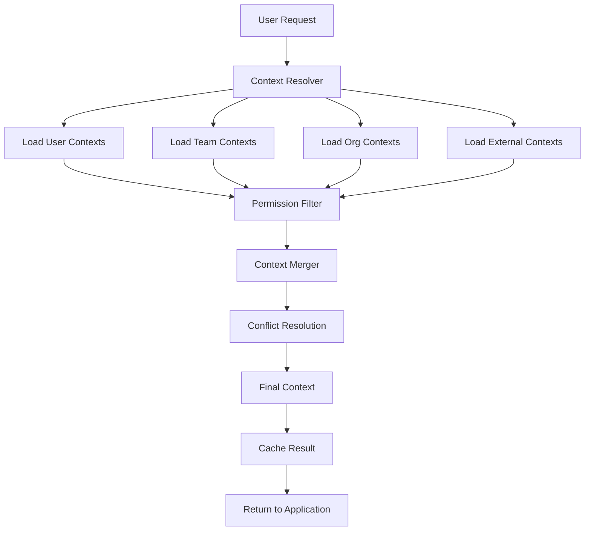

# Prompt Contexts - Product Requirements Document

## Executive Summary

The Prompt Contexts system enables hierarchical AI personality configuration through layered prompt contexts that seamlessly merge to create personalized, consistent AI interactions across all LeaderForge features. This system transforms AI from a generic tool into an intelligent assistant that understands organizational values, team dynamics, and individual preferences while maintaining strict role-based access controls.

## Document Information

- **Document Version**: 1.0
- **Last Updated**: [Current Date]
- **Author**: [Glen Hobbs]
- **Status**: Draft
- **Target Release**: Q2 2025

---

## Table of Contents

1. [Product Overview](#product-overview)
2. [User Personas & Access Scenarios](#user-personas--access-scenarios)
3. [Role-Based Access Control (RBAC)](#role-based-access-control-rbac)
4. [Functional Requirements](#functional-requirements)
5. [Technical Architecture](#technical-architecture)
6. [Database Schema](#database-schema)
7. [API Specifications](#api-specifications)
8. [Security & Privacy](#security--privacy)
9. [Integration Requirements](#integration-requirements)
10. [Success Metrics](#success-metrics)
11. [Implementation Timeline](#implementation-timeline)

---

## Product Overview

### Purpose Statement
The Prompt Contexts system provides a hierarchical framework for configuring AI behavior that automatically adapts to user roles, team dynamics, organizational values, and external frameworks, ensuring consistent and contextually appropriate AI interactions across all platform features.

### Core Value Propositions
- **Consistent AI Personality**: AI maintains consistent voice and approach across all interactions
- **Contextual Intelligence**: AI understands organizational culture, team dynamics, and individual preferences
- **Scalable Configuration**: Easy management of AI behavior at scale across large organizations
- **Seamless Integration**: Automatic context inheritance across all AI-powered features
- **Security & Privacy**: Role-based access ensures sensitive contexts remain protected

### Key Features
- Hierarchical context inheritance (Personal → Team → Organization → External)
- Real-time context testing and preview capabilities
- Role-based context creation and management
- Context versioning and audit trails
- Integration with CopilotKit and all AI features
- Private and shared context management

### Context Hierarchy Model

```
External Contexts (LeaderForge, Industry Standards)
    ↓
Organization Contexts (Company Values, Culture)
    ↓
Team Contexts (Department-specific Guidelines)
    ↓
Personal Contexts (Individual Preferences)
    ↓
Session Contexts (Temporary Overrides)
```

**Inheritance Rule**: Lower-level contexts override higher-level contexts for conflicting directives while additively merging complementary information.

---

## User Personas & Access Scenarios

### Primary Personas

#### 1. **Organization Administrator** (CEO, CTO, Chief People Officer)
**Access Needs**: Create and manage organization-wide contexts, view all team contexts, audit trail access
**Use Cases**: Set company-wide AI behavior, ensure brand consistency, maintain organizational values alignment
**Pain Points**: Need to balance consistency with team autonomy, ensure sensitive information remains secure

#### 2. **Team Leader** (Department Managers, Project Leads)
**Access Needs**: Create team-specific contexts, manage team member access, view team analytics
**Use Cases**: Department-specific guidance, team culture reinforcement, specialized workflows
**Pain Points**: Need contexts that complement rather than conflict with organizational standards

#### 3. **Individual Contributor** (Employees, Specialists)
**Access Needs**: Create personal contexts, access team/org contexts, customize preferences
**Use Cases**: Personal communication style, role-specific guidance, individual productivity optimization
**Pain Points**: Want personalization without losing team collaboration benefits

#### 4. **External Partner** (Consultants, Contractors)
**Access Needs**: Limited access to relevant contexts, restricted creation capabilities
**Use Cases**: Temporary project alignment, specialized expertise integration
**Pain Points**: Need enough context to be effective without accessing sensitive information

#### 5. **System Administrator** (IT Admin, Security Officer)
**Access Needs**: Full system access, audit capabilities, security monitoring
**Use Cases**: Security compliance, troubleshooting, performance monitoring
**Pain Points**: Need comprehensive oversight without interfering with business operations

### Access Scenarios

#### Scenario 1: New Employee Onboarding
```
User: New Individual Contributor
Action: First access to Prompt Contexts
Expected Behavior:
- Automatically inherits organization and team contexts
- Guided through creating personal context
- Preview how contexts combine
- Cannot see private contexts from other users
- Can view but not edit team/org contexts
```

#### Scenario 2: Cross-Team Collaboration
```
User: Marketing Team Member working with Sales Team
Action: Participates in joint project requiring Sales context
Expected Behavior:
- Maintains Marketing team context
- Granted temporary read access to relevant Sales contexts
- Can see how combined contexts affect AI behavior
- Cannot edit Sales team contexts
- Access automatically expires after project
```

#### Scenario 3: Sensitive Context Management
```
User: HR Team Leader creating compensation context
Action: Creates private HR context for salary discussions
Expected Behavior:
- Context marked as "HR Private"
- Only HR team members can see context
- Cannot be viewed by other team leaders
- Audit trail tracks all access attempts
- Integration with entitlement system
```

#### Scenario 4: Context Conflict Resolution
```
User: Executive creating new organization context
Action: New org context conflicts with existing team contexts
Expected Behavior:
- System identifies potential conflicts
- Shows preview of how contexts will merge
- Suggests resolution strategies
- Allows staged rollout for testing
- Provides rollback capability
```

---

## Role-Based Access Control (RBAC)

### Permission Matrix

| Feature | Guest | Individual | Team Member | Team Leader | Executive | Org Admin | Sys Admin |
|---------|--------|------------|-------------|-------------|-----------|-----------|-----------|
| **VIEW CONTEXTS** | | | | | | | |
| Public external contexts | ✅ | ✅ | ✅ | ✅ | ✅ | ✅ | ✅ |
| Organization contexts | ❌ | ✅ | ✅ | ✅ | ✅ | ✅ | ✅ |
| Team contexts | ❌ | Own teams | Own teams | Own teams | All teams | All teams | All teams |
| Private team contexts | ❌ | ❌ | If granted | ✅ | If granted | ✅ | ✅ |
| Personal contexts | ❌ | Own only | Own only | Own only | Own only | All | All |
| Other users' personal | ❌ | ❌ | ❌ | ❌ | ❌ | Audit only | All |
| **CREATE CONTEXTS** | | | | | | | |
| Personal contexts | ❌ | ✅ | ✅ | ✅ | ✅ | ✅ | ✅ |
| Team contexts | ❌ | ❌ | Contribute | ✅ | ✅ | ✅ | ✅ |
| Private team contexts | ❌ | ❌ | ❌ | ✅ | ✅ | ✅ | ✅ |
| Organization contexts | ❌ | ❌ | ❌ | ❌ | ✅ | ✅ | ✅ |
| External contexts | ❌ | ❌ | ❌ | ❌ | ❌ | ❌ | ✅ |
| **EDIT CONTEXTS** | | | | | | | |
| Own personal contexts | ❌ | ✅ | ✅ | ✅ | ✅ | ✅ | ✅ |
| Team contexts | ❌ | ❌ | Suggest | ✅ | ✅ | ✅ | ✅ |
| Organization contexts | ❌ | ❌ | ❌ | ❌ | ✅ | ✅ | ✅ |
| External contexts | ❌ | ❌ | ❌ | ❌ | ❌ | ❌ | ✅ |
| **ADMIN FUNCTIONS** | | | | | | | |
| View usage analytics | ❌ | Personal | Personal | Team | Org | All | All |
| Manage access grants | ❌ | ❌ | ❌ | Team level | Org level | All | All |
| Audit trail access | ❌ | Personal | Personal | Team | Org | All | All |
| Emergency override | ❌ | ❌ | ❌ | ❌ | ❌ | Limited | Full |
| System configuration | ❌ | ❌ | ❌ | ❌ | ❌ | ❌ | ✅ |

### Context Visibility Levels

#### 1. **Public** (Visibility: All authenticated users)
- LeaderForge framework contexts
- Industry-standard templates
- Community-contributed contexts
- Basic productivity contexts

#### 2. **Organization** (Visibility: Organization members only)
- Company values and culture
- Brand voice guidelines
- Standard operating procedures
- Organizational terminology

#### 3. **Team** (Visibility: Team members only)
- Department-specific guidance
- Team communication styles
- Role-specific instructions
- Project-based contexts

#### 4. **Team Private** (Visibility: Team leaders + explicitly granted)
- Sensitive team information
- HR-related contexts
- Financial guidelines
- Strategic planning contexts

#### 5. **Personal** (Visibility: Individual user only)
- Personal communication preferences
- Individual working styles
- Private shortcuts and templates
- Personal productivity contexts

#### 6. **System** (Visibility: System administrators only)
- Platform configuration contexts
- Security and compliance contexts
- Technical troubleshooting contexts
- Emergency response contexts

### Entitlement Integration Points

#### Plan-Based Context Limits
```typescript
interface ContextEntitlements {
  planTier: 'starter' | 'professional' | 'enterprise' | 'custom';
  maxPersonalContexts: number;
  maxTeamContexts: number;
  canCreatePrivateTeamContexts: boolean;
  canCreateOrganizationContexts: boolean;
  advancedContextFeatures: boolean;
  contextAnalytics: boolean;
  auditTrailRetention: number; // days
  apiAccess: boolean;
  bulkImport: boolean;
  customIntegrations: boolean;
}
```

#### Dynamic Permission Resolution
```typescript
function canAccessContext(user: User, context: PromptContext): AccessResult {
  // Check plan entitlements
  if (context.requiresPremium && !user.entitlements.advancedContextFeatures) {
    return { allowed: false, reason: 'PREMIUM_REQUIRED' };
  }
  
  // Check visibility level permissions
  switch (context.visibilityLevel) {
    case 'personal':
      return { allowed: context.creatorId === user.id };
      
    case 'team':
      return { 
        allowed: user.teams.some(team => 
          context.teamIds.includes(team.id) && 
          team.hasPermission('view_team_contexts')
        )
      };
      
    case 'team_private':
      return {
        allowed: context.explicitGrants.includes(user.id) ||
                 user.roles.some(role => role.permissions.includes('view_private_team_contexts'))
      };
      
    case 'organization':
      return { 
        allowed: user.organizationId === context.organizationId &&
                 user.roles.some(role => role.permissions.includes('view_org_contexts'))
      };
      
    case 'system':
      return { 
        allowed: user.roles.some(role => role.permissions.includes('system_admin'))
      };
      
    default:
      return { allowed: true }; // Public contexts
  }
}
```

#### Context Creation Limits
```typescript
interface ContextCreationLimits {
  personalContextsUsed: number;
  personalContextsLimit: number;
  teamContextsUsed: number;
  teamContextsLimit: number;
  canCreatePrivateContexts: boolean;
  canCreateOrgContexts: boolean;
  
  // Validation method
  canCreateContext(type: ContextType, user: User): ValidationResult;
}
```

---

## Functional Requirements

### Core Features

#### 1. Context Creation & Management

**FR-001: Context Creation Interface**
- Rich text editor with markdown support and syntax highlighting
- Template variables and placeholder system
- Context preview with sample AI responses
- Import/export functionality for context portability
- Collaboration features for team context development

**FR-002: Context Organization**
- Hierarchical categorization system
- Tag-based organization and filtering
- Search functionality across all accessible contexts
- Favorites and recently used contexts
- Custom folders and organization schemes

**FR-003: Version Control & History**
- Automatic versioning of all context changes
- Change tracking with diff visualization
- Rollback capability to previous versions
- Change attribution and timestamps
- Branch/merge functionality for collaborative editing

#### 2. Context Hierarchy & Inheritance

**FR-004: Hierarchical Resolution**
- Automatic context merging following inheritance rules
- Conflict detection and resolution strategies
- Override capabilities for lower-level contexts
- Additive merging for complementary directives
- Priority weighting system for context elements

**FR-005: Context Testing & Preview**
- Real-time preview of merged context effects
- Test scenarios with sample prompts
- Before/after comparison of AI responses
- Context impact visualization
- Performance impact assessment

**FR-006: Dynamic Context Application**
- Automatic context inheritance in all AI interactions
- Context-aware prompt suggestions
- Real-time context switching capabilities
- Session-based temporary context overrides
- Context effectiveness tracking

#### 3. Access Control & Security

**FR-007: Role-Based Access Management**
- Granular permission system for context access
- Role-based context creation and editing rights
- Team and organization isolation boundaries
- External partner access controls
- Time-limited access grants

**FR-008: Privacy & Confidentiality**
- Private context encryption at rest
- Secure context sharing mechanisms
- Audit trail for all context access
- Data retention and deletion policies
- Compliance with privacy regulations

**FR-009: Context Isolation**
- Secure separation between organization contexts
- Team context visibility controls
- Personal context privacy protection
- Guest access limitations
- Cross-organization security barriers

#### 4. Analytics & Optimization

**FR-010: Usage Analytics**
- Context usage frequency and effectiveness tracking
- AI response quality correlation with contexts
- User satisfaction metrics for context-driven interactions
- Performance impact analysis
- Optimization recommendations

**FR-011: Context Effectiveness Measurement**
- Success rate tracking for context-driven interactions
- User feedback integration for context quality
- A/B testing capabilities for context variations
- Machine learning insights for context optimization
- Automated context improvement suggestions

### Integration Features

#### 5. CopilotKit Integration

**FR-012: Seamless Context Inheritance**
- Automatic context application in all CopilotKit interactions
- Real-time context merging during conversations
- Context-aware conversation history
- Dynamic context updating mid-conversation
- Context influence visualization in chat interface

**FR-013: Context-Aware Prompt Library**
- Automatic context application to library prompts
- Context-specific prompt recommendations
- Preview of prompt behavior with active contexts
- Context optimization suggestions for prompts
- Prompt effectiveness tracking with context combinations

#### 6. External System Integration

**FR-014: Enterprise System Integration**
- Single Sign-On (SSO) integration for context access
- LDAP/Active Directory role synchronization
- HR system integration for automatic team assignments
- Third-party context source integration
- API access for custom integrations

**FR-015: Workflow Integration**
- Context-triggered automation workflows
- Integration with project management systems
- Calendar integration for time-based contexts
- Document system integration for context sources
- Collaboration platform integration

---

## Technical Architecture

### System Components

#### Context Engine Architecture
```typescript
interface ContextEngine {
  resolver: ContextResolver;
  merger: ContextMerger;
  cache: ContextCache;
  validator: ContextValidator;
  analyzer: ContextAnalyzer;
}

interface ContextResolver {
  resolveContexts(userId: string, scope: ContextScope): Promise<ResolvedContext>;
  getInheritanceChain(userId: string): Promise<ContextChain>;
  detectConflicts(contexts: PromptContext[]): ContextConflict[];
  applyResolutionRules(conflicts: ContextConflict[]): ResolvedContext;
}

interface ContextMerger {
  mergeContexts(contexts: PromptContext[]): MergedContext;
  applyOverrides(baseContext: MergedContext, overrides: ContextOverride[]): MergedContext;
  optimizeForPerformance(context: MergedContext): OptimizedContext;
}
```

#### Context Storage Architecture
```typescript
interface ContextStorage {
  // Core storage operations
  create(context: PromptContext): Promise<string>;
  read(contextId: string, userId: string): Promise<PromptContext | null>;
  update(contextId: string, updates: Partial<PromptContext>, userId: string): Promise<void>;
  delete(contextId: string, userId: string): Promise<void>;
  
  // Hierarchy operations
  getInheritanceChain(userId: string): Promise<PromptContext[]>;
  getTeamContexts(teamId: string): Promise<PromptContext[]>;
  getOrganizationContexts(orgId: string): Promise<PromptContext[]>;
  
  // Access control
  checkAccess(contextId: string, userId: string, permission: Permission): Promise<boolean>;
  grantAccess(contextId: string, userId: string, permission: Permission): Promise<void>;
  revokeAccess(contextId: string, userId: string): Promise<void>;
}
```

### Data Flow Architecture

#### Context Resolution Flow


#### Context Cache Strategy
```typescript
interface ContextCacheStrategy {
  // Multi-level caching
  userCache: Map<string, ResolvedContext>; // 15 minutes TTL
  teamCache: Map<string, PromptContext[]>; // 60 minutes TTL
  orgCache: Map<string, PromptContext[]>; // 4 hours TTL
  externalCache: Map<string, PromptContext[]>; // 24 hours TTL
  
  // Cache invalidation
  invalidateUser(userId: string): void;
  invalidateTeam(teamId: string): void;
  invalidateOrganization(orgId: string): void;
  invalidateAll(): void;
  
  // Cache warming
  warmUserCache(userId: string): Promise<void>;
  warmTeamCache(teamId: string): Promise<void>;
}
```

### Performance Optimization

#### Context Compilation
```typescript
interface ContextCompiler {
  // Pre-compile contexts for faster resolution
  compileUserContexts(userId: string): Promise<CompiledContext>;
  compileTeamContexts(teamId: string): Promise<CompiledContext>;
  compileOrganizationContexts(orgId: string): Promise<CompiledContext>;
  
  // Optimization strategies
  optimizeInheritanceChain(chain: ContextChain): OptimizedChain;
  minimizeConflicts(contexts: PromptContext[]): PromptContext[];
  generateEfficientMerge(contexts: PromptContext[]): MergeStrategy;
}
```

#### Real-Time Updates
```typescript
interface ContextRealTimeSync {
  // WebSocket-based updates
  subscribeToContextUpdates(userId: string): WebSocketConnection;
  publishContextUpdate(contextId: string, update: ContextUpdate): void;
  
  // Event-driven invalidation
  onContextChanged(contextId: string, callback: ContextChangeCallback): void;
  onUserRoleChanged(userId: string, callback: RoleChangeCallback): void;
  onTeamMembershipChanged(userId: string, callback: MembershipChangeCallback): void;
}
```

---

## Database Schema

### Core Context Tables

#### Prompt Contexts Table
```sql
CREATE TABLE prompt_contexts (
    id UUID PRIMARY KEY,
    name VARCHAR(255) NOT NULL,
    description TEXT,
    content TEXT NOT NULL, -- JSON or structured context data
    context_type VARCHAR(50) NOT NULL CHECK (context_type IN ('personal', 'team', 'team_private', 'organization', 'external', 'system')),
    visibility_level VARCHAR(20) NOT NULL CHECK (visibility_level IN ('public', 'organization', 'team', 'team_private', 'personal', 'system')),
    
    -- Ownership and scope
    creator_id UUID REFERENCES users(id),
    organization_id UUID REFERENCES organizations(id),
    team_id UUID REFERENCES teams(id),
    
    -- Metadata
    is_active BOOLEAN DEFAULT TRUE,
    is_default BOOLEAN DEFAULT FALSE,
    priority_weight INTEGER DEFAULT 0,
    version INTEGER DEFAULT 1,
    parent_context_id UUID REFERENCES prompt_contexts(id),
    
    -- Content structure
    context_schema JSONB, -- Schema validation for content
    template_variables JSONB, -- Available variables for this context
    merge_strategy VARCHAR(20) DEFAULT 'additive' CHECK (merge_strategy IN ('additive', 'override', 'replace')),
    
    -- Usage and performance
    usage_count INTEGER DEFAULT 0,
    effectiveness_score DECIMAL(3,2) DEFAULT 0,
    last_used_at TIMESTAMP,
    
    -- Audit fields
    created_at TIMESTAMP DEFAULT NOW(),
    updated_at TIMESTAMP DEFAULT NOW(),
    created_by UUID REFERENCES users(id),
    updated_by UUID REFERENCES users(id)
);

-- Indexes for performance
CREATE INDEX idx_prompt_contexts_type ON prompt_contexts(context_type);
CREATE INDEX idx_prompt_contexts_visibility ON prompt_contexts(visibility_level);
CREATE INDEX idx_prompt_contexts_organization ON prompt_contexts(organization_id);
CREATE INDEX idx_prompt_contexts_team ON prompt_contexts(team_id);
CREATE INDEX idx_prompt_contexts_creator ON prompt_contexts(creator_id);
CREATE INDEX idx_prompt_contexts_active ON prompt_contexts(is_active);
CREATE INDEX idx_prompt_contexts_priority ON prompt_contexts(priority_weight DESC);
```

#### Context Permissions Table
```sql
CREATE TABLE context_permissions (
    id UUID PRIMARY KEY,
    context_id UUID REFERENCES prompt_contexts(id) ON DELETE CASCADE,
    
    -- Grant target (one of these will be non-null)
    user_id UUID REFERENCES users(id) ON DELETE CASCADE,
    team_id UUID REFERENCES teams(id) ON DELETE CASCADE,
    role_id UUID REFERENCES roles(id) ON DELETE CASCADE,
    
    -- Permission details
    permission_type VARCHAR(20) NOT NULL CHECK (permission_type IN ('read', 'write', 'admin', 'inherit')),
    is_inherited BOOLEAN DEFAULT FALSE,
    
    -- Grant metadata
    granted_by UUID REFERENCES users(id),
    granted_at TIMESTAMP DEFAULT NOW(),
    expires_at TIMESTAMP,
    is_active BOOLEAN DEFAULT TRUE,
    
    -- Constraints
    CONSTRAINT context_permissions_target_check 
        CHECK ((user_id IS NOT NULL)::integer + (team_id IS NOT NULL)::integer + (role_id IS NOT NULL)::integer = 1)
);

CREATE INDEX idx_context_permissions_context ON context_permissions(context_id);
CREATE INDEX idx_context_permissions_user ON context_permissions(user_id);
CREATE INDEX idx_context_permissions_team ON context_permissions(team_id);
CREATE INDEX idx_context_permissions_role ON context_permissions(role_id);
CREATE INDEX idx_context_permissions_active ON context_permissions(is_active);
```

#### Context Inheritance Rules Table
```sql
CREATE TABLE context_inheritance_rules (
    id UUID PRIMARY KEY,
    organization_id UUID REFERENCES organizations(id),
    rule_name VARCHAR(100) NOT NULL,
    rule_description TEXT,
    
    -- Inheritance configuration
    inheritance_order JSONB NOT NULL, -- Array defining inheritance priority
    conflict_resolution VARCHAR(20) DEFAULT 'lower_wins' CHECK (conflict_resolution IN ('lower_wins', 'higher_wins', 'merge', 'ask_user')),
    merge_strategy JSONB, -- Custom merge rules for specific context types
    
    -- Rule conditions
    applies_to_context_types VARCHAR(50)[] DEFAULT ARRAY['all'],
    applies_to_user_roles VARCHAR(50)[],
    applies_to_teams UUID[],
    
    -- Rule metadata
    is_active BOOLEAN DEFAULT TRUE,
    created_at TIMESTAMP DEFAULT NOW(),
    updated_at TIMESTAMP DEFAULT NOW(),
    created_by UUID REFERENCES users(id)
);
```

### Analytics and Usage Tables

#### Context Usage Analytics Table
```sql
CREATE TABLE context_usage_analytics (
    id UUID PRIMARY KEY,
    context_id UUID REFERENCES prompt_contexts(id),
    user_id UUID REFERENCES users(id),
    organization_id UUID REFERENCES organizations(id),
    
    -- Usage details
    usage_type VARCHAR(20) NOT NULL CHECK (usage_type IN ('ai_interaction', 'prompt_execution', 'preview', 'test')),
    session_id VARCHAR(255),
    interaction_id UUID,
    
    -- Context state
    merged_context_hash VARCHAR(64), -- Hash of the merged context for deduplication
    context_chain JSONB, -- The full inheritance chain used
    conflicts_detected INTEGER DEFAULT 0,
    resolution_time_ms INTEGER,
    
    -- Effectiveness metrics
    user_satisfaction_rating INTEGER CHECK (user_satisfaction_rating BETWEEN 1 AND 5),
    ai_response_quality_score DECIMAL(3,2),
    task_completion_success BOOLEAN,
    
    -- Performance metrics
    context_resolution_time_ms INTEGER,
    context_size_bytes INTEGER,
    cache_hit BOOLEAN,
    
    created_at TIMESTAMP DEFAULT NOW()
);

CREATE INDEX idx_context_usage_context ON context_usage_analytics(context_id);
CREATE INDEX idx_context_usage_user ON context_usage_analytics(user_id);
CREATE INDEX idx_context_usage_organization ON context_usage_analytics(organization_id);
CREATE INDEX idx_context_usage_created_at ON context_usage_analytics(created_at);
CREATE INDEX idx_context_usage_type ON context_usage_analytics(usage_type);
```

#### Context Effectiveness Metrics Table
```sql
CREATE TABLE context_effectiveness_metrics (
    id UUID PRIMARY KEY,
    context_id UUID REFERENCES prompt_contexts(id),
    organization_id UUID REFERENCES organizations(id),
    
    -- Time period for metrics
    period_start TIMESTAMP NOT NULL,
    period_end TIMESTAMP NOT NULL,
    period_type VARCHAR(20) DEFAULT 'daily' CHECK (period_type IN ('hourly', 'daily', 'weekly', 'monthly')),
    
    -- Usage metrics
    total_uses INTEGER DEFAULT 0,
    unique_users INTEGER DEFAULT 0,
    average_session_duration INTEGER, -- seconds
    
    -- Quality metrics
    average_satisfaction_rating DECIMAL(3,2),
    average_ai_quality_score DECIMAL(3,2),
    task_success_rate DECIMAL(5,2), -- percentage
    
    -- Performance metrics
    average_resolution_time_ms INTEGER,
    cache_hit_rate DECIMAL(5,2), -- percentage
    conflict_rate DECIMAL(5,2), -- percentage
    
    -- Improvement suggestions
    optimization_suggestions JSONB,
    
    created_at TIMESTAMP DEFAULT NOW(),
    
    UNIQUE(context_id, period_start, period_end, period_type)
);
```

### Version Control Tables

#### Context Versions Table
```sql
CREATE TABLE context_versions (
    id UUID PRIMARY KEY,
    context_id UUID REFERENCES prompt_contexts(id) ON DELETE CASCADE,
    version_number INTEGER NOT NULL,
    
    -- Version content
    name VARCHAR(255) NOT NULL,
    description TEXT,
    content TEXT NOT NULL,
    context_schema JSONB,
    template_variables JSONB,
    
    -- Change tracking
    change_type VARCHAR(20) NOT NULL CHECK (change_type IN ('create', 'update', 'delete', 'merge', 'rollback')),
    change_summary TEXT,
    change_details JSONB, -- Detailed diff information
    
    -- Version metadata
    created_by UUID REFERENCES users(id),
    created_at TIMESTAMP DEFAULT NOW(),
    is_current BOOLEAN DEFAULT FALSE,
    
    UNIQUE(context_id, version_number)
);

CREATE INDEX idx_context_versions_context ON context_versions(context_id);
CREATE INDEX idx_context_versions_current ON context_versions(is_current);
CREATE INDEX idx_context_versions_created_at ON context_versions(created_at);
```

#### Context Change Approvals Table
```sql
CREATE TABLE context_change_approvals (
    id UUID PRIMARY KEY,
    context_id UUID REFERENCES prompt_contexts(id),
    proposed_changes JSONB NOT NULL,
    change_reason TEXT,
    
    -- Approval workflow
    requested_by UUID REFERENCES users(id),
    requested_at TIMESTAMP DEFAULT NOW(),
    
    approver_id UUID REFERENCES users(id),
    approval_status VARCHAR(20) DEFAULT 'pending' CHECK (approval_status IN ('pending', 'approved', 'rejected', 'cancelled')),
    approval_comments TEXT,
    approved_at TIMESTAMP,
    
    -- Implementation
    implemented_at TIMESTAMP,
    implementation_notes TEXT,
    
    -- Expiration
    expires_at TIMESTAMP
);
```

---

## API Specifications

### REST API Endpoints

#### Context Management API

```typescript
// GET /api/contexts
interface GetContextsRequest {
  type?: ContextType[];
  visibility?: VisibilityLevel[];
  teamId?: string;
  includeInherited?: boolean;
  includeInactive?: boolean;
  page?: number;
  limit?: number;
}

interface GetContextsResponse {
  contexts: PromptContext[];
  totalCount: number;
  inheritanceChain: ContextInheritance[];
  permissions: ContextPermissionSummary;
}

// GET /api/contexts/{id}
interface GetContextResponse {
  context: PromptContext;
  permissions: UserContextPermissions;
  usage: ContextUsageStats;
  versions: ContextVersion[];
  effectivenessMetrics: EffectivenessMetrics;
}

// POST /api/contexts
interface CreateContextRequest {
  name: string;
  description?: string;
  content: string;
  contextType: ContextType;
  visibilityLevel: VisibilityLevel;
  teamId?: string;
  templateVariables?: TemplateVariable[];
  mergeStrategy?: MergeStrategy;
  priorityWeight?: number;
}

interface CreateContextResponse {
  context: PromptContext;
  success: boolean;
  validationErrors?: ValidationError[];
  warnings?: Warning[];
}

// PUT /api/contexts/{id}
interface UpdateContextRequest {
  name?: string;
  description?: string;
  content?: string;
  templateVariables?: TemplateVariable[];
  mergeStrategy?: MergeStrategy;
  priorityWeight?: number;
  changeSummary?: string;
  requiresApproval?: boolean;
}

// DELETE /api/contexts/{id}
interface DeleteContextRequest {
  force?: boolean; // Skip approval for eligible users
  reason?: string;
}
```

#### Context Resolution API

```typescript
// POST /api/contexts/resolve
interface ResolveContextsRequest {
  userId?: string;
  teamId?: string;
  sessionOverrides?: ContextOverride[];
  includeAnalytics?: boolean;
}

interface ResolveContextsResponse {
  resolvedContext: ResolvedContext;
  inheritanceChain: ContextInheritance[];
  conflicts: ContextConflict[];
  resolutionMetrics: ResolutionMetrics;
  cacheInfo: CacheInfo;
}

// POST /api/contexts/preview
interface PreviewContextRequest {
  baseContexts: string[]; // Context IDs
  testPrompt: string;
  sessionOverrides?: ContextOverride[];
}

interface PreviewContextResponse {
  mergedContext: MergedContext;
  sampleResponse: string;
  contextInfluence: ContextInfluenceAnalysis;
  conflicts: ContextConflict[];
  recommendations: ContextOptimizationSuggestion[];
}

// POST /api/contexts/test
interface TestContextRequest {
  contextId: string;
  testScenarios: TestScenario[];
  comparisonContexts?: string[];
}

interface TestContextResponse {
  results: TestResult[];
  performanceMetrics: PerformanceMetrics;
  qualityScores: QualityScore[];
  recommendations: string[];
}
```

#### Permissions API

```typescript
// GET /api/contexts/{id}/permissions
interface GetContextPermissionsResponse {
  contextId: string;
  owner: User;
  permissions: ContextPermission[];
  inheritedPermissions: InheritedPermission[];
  effectivePermissions: EffectivePermissions;
}

// POST /api/contexts/{id}/permissions
interface GrantContextPermissionRequest {
  userId?: string;
  teamId?: string;
  roleId?: string;
  permissionType: PermissionType;
  expiresAt?: string;
}

// DELETE /api/contexts/{id}/permissions/{permissionId}
interface RevokeContextPermissionResponse {
  success: boolean;
  affectedUsers: string[];
  cascadeEffects: CascadeEffect[];
}

// GET /api/users/{userId}/context-access
interface GetUserContextAccessResponse {
  userId: string;
  accessibleContexts: ContextAccessSummary[];
  inheritanceChain: ContextInheritance[];
  restrictions: AccessRestriction[];
  entitlements: ContextEntitlements;
}
```

#### Analytics API

```typescript
// GET /api/contexts/{id}/analytics
interface GetContextAnalyticsRequest {
  startDate?: string;
  endDate?: string;
  granularity?: 'hour' | 'day' | 'week' | 'month';
  includeUsers?: boolean;
  includePerformance?: boolean;
}

interface GetContextAnalyticsResponse {
  contextId: string;
  period: DateRange;
  usage: UsageAnalytics;
  effectiveness: EffectivenessAnalytics;
  performance: PerformanceAnalytics;
  trends: TrendAnalysis;
  recommendations: AnalyticsRecommendation[];
}

// GET /api/analytics/context-dashboard
interface ContextDashboardResponse {
  personalStats: PersonalContextStats;
  teamStats?: TeamContextStats;
  organizationStats?: OrganizationContextStats;
  systemHealth: SystemHealthMetrics;
  alerts: ContextAlert[];
}

// POST /api/analytics/context-usage
interface TrackContextUsageRequest {
  contextIds: string[];
  usageType: UsageType;
  sessionId: string;
  interactionId?: string;
  performanceMetrics: PerformanceMetrics;
  userFeedback?: UserFeedback;
}
```

### GraphQL Schema

```graphql
type PromptContext {
  id: ID!
  name: String!
  description: String
  content: String!
  contextType: ContextType!
  visibilityLevel: VisibilityLevel!
  
  # Ownership
  creator: User!
  organization: Organization
  team: Team
  
  # Configuration
  isActive: Boolean!
  isDefault: Boolean!
  priorityWeight: Int!
  version: Int!
  parentContext: PromptContext
  
  # Structure
  templateVariables: [TemplateVariable!]!
  mergeStrategy: MergeStrategy!
  
  # Metadata
  usageCount: Int!
  effectivenessScore: Float!
  lastUsedAt: DateTime
  createdAt: DateTime!
  updatedAt: DateTime!
  
  # Computed fields
  permissions: ContextPermissions!
  canEdit: Boolean!
  canDelete: Boolean!
  canShare: Boolean!
  versions: [ContextVersion!]!
  usage: ContextUsageStats!
  effectiveness: EffectivenessMetrics!
}

type ResolvedContext {
  userId: ID!
  resolvedContent: String!
  inheritanceChain: [ContextInheritance!]!
  conflicts: [ContextConflict!]!
  resolutionTime: Int!
  cacheHit: Boolean!
  
  # Component contexts
  personalContexts: [PromptContext!]!
  teamContexts: [PromptContext!]!
  organizationContexts: [PromptContext!]!
  externalContexts: [PromptContext!]!
}

type Query {
  # Context queries
  contexts(
    filters: ContextFilters
    sort: ContextSort
    page: Int = 1
    limit: Int = 20
  ): ContextConnection!
  
  context(id: ID!): PromptContext
  
  # Resolution queries
  resolveContexts(
    userId: ID
    sessionOverrides: [ContextOverrideInput!]
  ): ResolvedContext!
  
  previewContext(
    contextIds: [ID!]!
    testPrompt: String!
    overrides: [ContextOverrideInput!]
  ): ContextPreview!
  
  # User contexts
  myContexts: [PromptContext!]!
  myResolvedContext: ResolvedContext!
  
  # Team and organization contexts
  teamContexts(teamId: ID!): [PromptContext!]!
  organizationContexts: [PromptContext!]!
  
  # Analytics
  contextAnalytics(
    contextId: ID!
    period: DateRange!
  ): ContextAnalytics!
  
  contextDashboard: ContextDashboard!
}

type Mutation {
  # Context management
  createContext(input: CreateContextInput!): CreateContextPayload!
  updateContext(id: ID!, input: UpdateContextInput!): UpdateContextPayload!
  deleteContext(id: ID!, reason: String): DeleteContextPayload!
  
  # Version control
  createContextVersion(contextId: ID!, changeSummary: String): ContextVersion!
  rollbackContext(contextId: ID!, versionNumber: Int!): UpdateContextPayload!
  
  # Permissions
  grantContextPermission(input: GrantPermissionInput!): GrantPermissionPayload!
  revokeContextPermission(input: RevokePermissionInput!): RevokePermissionPayload!
  
  # Testing and optimization
  testContext(contextId: ID!, scenarios: [TestScenarioInput!]!): TestContextPayload!
  optimizeContext(contextId: ID!): OptimizeContextPayload!
  
  # Usage tracking
  trackContextUsage(input: TrackUsageInput!): TrackUsagePayload!
}

type Subscription {
  # Real-time updates
  contextUpdated(contextId: ID!): PromptContext!
  contextResolutionChanged(userId: ID!): ResolvedContext!
  
  # Team updates
  teamContextActivity(teamId: ID!): ContextActivity!
  organizationContextActivity: ContextActivity!
  
  # Analytics updates
  contextMetricsUpdated(contextId: ID!): ContextAnalytics!
}
```

---

## Security & Privacy

### Data Protection & Encryption

#### Encryption Strategy
```typescript
interface ContextEncryption {
  // Encryption at rest
  sensitiveContextEncryption: {
    algorithm: 'AES-256-GCM';
    keyRotation: '90-days';
    keyManagement: 'AWS-KMS' | 'HashiCorp-Vault';
  };
  
  // Encryption in transit
  transportEncryption: {
    protocol: 'TLS-1.3';
    certificateManagement: 'automated';
    perfectForwardSecrecy: true;
  };
  
  // Field-level encryption
  fieldEncryption: {
    sensitiveFields: ['content', 'description'];
    encryptionKey: 'organization-specific';
    accessLogging: true;
  };
}
```

#### Context Privacy Levels
```typescript
enum ContextPrivacyLevel {
  PUBLIC = 'public',           // No encryption, full visibility
  INTERNAL = 'internal',       // Organization-level encryption
  CONFIDENTIAL = 'confidential', // Team-level encryption
  SECRET = 'secret',           // Individual-level encryption
  TOP_SECRET = 'top_secret'    // System-admin only
}

interface ContextPrivacyConfig {
  privacyLevel: ContextPrivacyLevel;
  encryptionRequired: boolean;
  accessLogging: boolean;
  retentionPeriod: number; // days
  deletionPolicy: 'immediate' | 'staged' | 'archive';
  auditRequirements: AuditRequirement[];
}
```

### Access Control Security

#### Authentication Requirements
```typescript
interface ContextAuthConfig {
  // Multi-factor authentication for sensitive contexts
  mfaRequired: {
    topSecretContexts: true;
    secretContexts: true;
    confidentialContexts: false;
    internalContexts: false;
  };
  
  // Session management
  sessionConfig: {
    maxDuration: '8-hours';
    idleTimeout: '30-minutes';
    concurrentSessions: 3;
    sessionValidation: 'continuous';
  };
  
  // API authentication
  apiAuth: {
    requireApiKey: true;
    rateLimiting: true;
    requestSigning: true;
    ipWhitelisting: boolean;
  };
}
```

#### Permission Validation
```typescript
interface PermissionValidator {
  // Real-time permission checking
  validateAccess(
    userId: string,
    contextId: string,
    action: ContextAction,
    requestContext: RequestContext
  ): Promise<AccessDecision>;
  
  // Permission caching with TTL
  cachePermissions(
    userId: string,
    permissions: Permission[],
    ttl: number
  ): void;
  
  // Permission inheritance validation
  validateInheritedPermissions(
    userId: string,
    contextChain: ContextChain
  ): Promise<ValidationResult>;
}
```

### Audit & Compliance

#### Comprehensive Audit Logging
```sql
CREATE TABLE context_audit_logs (
    id UUID PRIMARY KEY,
    
    -- Event details
    event_type VARCHAR(50) NOT NULL, -- create, read, update, delete, access_grant, access_revoke
    event_category VARCHAR(20) NOT NULL, -- context_management, access_control, data_access
    
    -- Context information
    context_id UUID REFERENCES prompt_contexts(id),
    context_type VARCHAR(50),
    visibility_level VARCHAR(20),
    
    -- User and session information
    user_id UUID REFERENCES users(id),
    organization_id UUID REFERENCES organizations(id),
    session_id VARCHAR(255),
    ip_address INET,
    user_agent TEXT,
    
    -- Change details
    old_values JSONB,
    new_values JSONB,
    change_reason TEXT,
    
    -- Access context
    access_method VARCHAR(20), -- web, api, mobile
    permission_used VARCHAR(20),
    is_inherited_permission BOOLEAN,
    
    -- Security context
    risk_level VARCHAR(10) CHECK (risk_level IN ('low', 'medium', 'high', 'critical')),
    requires_review BOOLEAN DEFAULT FALSE,
    
    -- Compliance fields
    compliance_tags VARCHAR(50)[],
    retention_required_until DATE,
    
    created_at TIMESTAMP DEFAULT NOW()
);

-- Indexes for audit queries
CREATE INDEX idx_context_audit_user ON context_audit_logs(user_id);
CREATE INDEX idx_context_audit_context ON context_audit_logs(context_id);
CREATE INDEX idx_context_audit_event_type ON context_audit_logs(event_type);
CREATE INDEX idx_context_audit_created_at ON context_audit_logs(created_at);
CREATE INDEX idx_context_audit_risk_level ON context_audit_logs(risk_level);
```

#### Compliance Framework
```typescript
interface ComplianceFramework {
  // Regulatory compliance
  regulations: {
    gdpr: GDPRCompliance;
    ccpa: CCPACompliance;
    soc2: SOC2Compliance;
    iso27001: ISO27001Compliance;
  };
  
  // Data governance
  dataGovernance: {
    dataClassification: DataClassificationPolicy;
    retentionPolicies: RetentionPolicy[];
    deletionProcedures: DeletionProcedure[];
    accessReviewProcedures: AccessReviewProcedure[];
  };
  
  // Monitoring and alerting
  monitoring: {
    suspiciousActivityDetection: boolean;
    unusualAccessPatterns: boolean;
    dataExfiltrationDetection: boolean;
    complianceViolationAlerts: boolean;
  };
}
```

---

## Integration Requirements

### Entitlement Management Integration

#### Real-Time Entitlement Checking
```typescript
interface EntitlementIntegration {
  // Check context creation limits
  async canCreateContext(
    userId: string,
    contextType: ContextType,
    visibilityLevel: VisibilityLevel
  ): Promise<EntitlementCheckResult> {
    const entitlements = await this.getEntitlements(userId);
    const currentUsage = await this.getCurrentUsage(userId);
    
    // Check plan limits
    switch (contextType) {
      case 'personal':
        return {
          allowed: currentUsage.personalContexts < entitlements.maxPersonalContexts,
          remainingQuota: entitlements.maxPersonalContexts - currentUsage.personalContexts,
          upgradeRequired: entitlements.maxPersonalContexts === 0
        };
        
      case 'team':
        return {
          allowed: currentUsage.teamContexts < entitlements.maxTeamContexts &&
                   entitlements.canCreateTeamContexts,
          remainingQuota: entitlements.maxTeamContexts - currentUsage.teamContexts,
          upgradeRequired: !entitlements.canCreateTeamContexts
        };
        
      case 'team_private':
        return {
          allowed: entitlements.canCreatePrivateTeamContexts,
          upgradeRequired: !entitlements.canCreatePrivateTeamContexts
        };
    }
  }
  
  // Track usage for billing
  async trackContextUsage(
    userId: string,
    contextType: ContextType,
    usageMetrics: UsageMetrics
  ): Promise<void> {
    await this.billingSystem.recordUsage({
      userId,
      feature: 'prompt_contexts',
      subFeature: contextType,
      quantity: 1,
      metadata: usageMetrics,
      timestamp: new Date()
    });
  }
}
```

#### Subscription Event Handling
```typescript
interface SubscriptionEventHandler {
  // Handle plan changes
  async onPlanUpgrade(event: PlanUpgradeEvent): Promise<void> {
    const userId = event.userId;
    const newEntitlements = event.newEntitlements;
    
    // Update user entitlements
    await this.updateUserEntitlements(userId, newEntitlements);
    
    // Enable new features
    await this.enableFeatures(userId, newEntitlements.enabledFeatures);
    
    // Notify user of new capabilities
    await this.notificationService.sendUpgradeNotification(userId, newEntitlements);
  }
  
  async onPlanDowngrade(event: PlanDowngradeEvent): Promise<void> {
    const userId = event.userId;
    const newEntitlements = event.newEntitlements;
    
    // Check for contexts that exceed new limits
    const excessContexts = await this.findExcessContexts(userId, newEntitlements);
    
    if (excessContexts.length > 0) {
      // Provide grace period and migration options
      await this.handleContextMigration(userId, excessContexts, newEntitlements);
    }
    
    // Update entitlements
    await this.updateUserEntitlements(userId, newEntitlements);
  }
}
```

### CopilotKit Integration

#### Context Resolution for AI Interactions
```typescript
interface CopilotKitContextIntegration {
  // Automatic context resolution for chat interactions
  async resolveContextsForChat(
    userId: string,
    conversationContext: ConversationContext
  ): Promise<ResolvedContextForAI> {
    // Get user's active contexts
    const resolvedContext = await this.contextResolver.resolveContexts(userId);
    
    // Apply conversation-specific overrides
    const contextWithOverrides = await this.applyConversationOverrides(
      resolvedContext,
      conversationContext
    );
    
    // Optimize for AI consumption
    const optimizedContext = await this.optimizeForAI(contextWithOverrides);
    
    return {
      systemMessage: optimizedContext.systemMessage,
      behaviorModifiers: optimizedContext.behaviorModifiers,
      responseStyle: optimizedContext.responseStyle,
      domainKnowledge: optimizedContext.domainKnowledge,
      restrictions: optimizedContext.restrictions
    };
  }
  
  // Real-time context updates during conversations
  async updateConversationContext(
    conversationId: string,
    contextUpdates: ContextUpdate[]
  ): Promise<void> {
    // Apply updates to active conversation
    await this.conversationManager.updateContext(conversationId, contextUpdates);
    
    // Notify CopilotKit of context changes
    await this.copilotKitApi.updateConversationContext(conversationId, {
      updatedSystemMessage: contextUpdates.systemMessage,
      behaviorModifiers: contextUpdates.behaviorModifiers
    });
  }
}
```

#### Context-Aware Prompt Library Integration
```typescript
interface PromptLibraryContextIntegration {
  // Preview prompt with user's contexts
  async previewPromptWithContexts(
    userId: string,
    promptId: string
  ): Promise<PromptPreview> {
    const prompt = await this.promptLibrary.getPrompt(promptId);
    const userContexts = await this.contextResolver.resolveContexts(userId);
    
    // Merge prompt with contexts
    const mergedPrompt = await this.mergePromptWithContexts(prompt, userContexts);
    
    // Generate sample response
    const sampleResponse = await this.generateSampleResponse(mergedPrompt);
    
    return {
      originalPrompt: prompt.content,
      contextInfluence: this.analyzeContextInfluence(prompt, userContexts),
      mergedPrompt: mergedPrompt.content,
      sampleResponse: sampleResponse,
      expectedBehavior: mergedPrompt.expectedBehavior
    };
  }
  
  // Execute prompt with contexts
  async executePromptWithContexts(
    userId: string,
    promptId: string,
    promptVariables: Record<string, any>
  ): Promise<CopilotKitExecution> {
    const resolvedContexts = await this.contextResolver.resolveContexts(userId);
    const prompt = await this.promptLibrary.getPrompt(promptId);
    
    // Populate prompt template with variables
    const populatedPrompt = await this.populatePromptTemplate(prompt, promptVariables);
    
    // Launch CopilotKit with merged context and prompt
    return await this.copilotKitApi.executePrompt({
      prompt: populatedPrompt,
      systemContext: resolvedContexts.systemMessage,
      behaviorModifiers: resolvedContexts.behaviorModifiers,
      userId: userId,
      sessionId: this.generateSessionId()
    });
  }
}
```

### External System Integration

#### HR System Integration for Role-Based Contexts
```typescript
interface HRSystemIntegration {
  // Sync user roles and team memberships
  async syncUserRoles(userId: string): Promise<RoleSync> {
    const hrData = await this.hrSystem.getUserData(userId);
    
    // Update user's team memberships
    await this.updateUserTeams(userId, hrData.teams);
    
    // Update user's role assignments
    await this.updateUserRoles(userId, hrData.roles);
    
    // Refresh context permissions
    await this.refreshContextPermissions(userId);
    
    // Trigger context resolution cache invalidation
    await this.contextCache.invalidateUser(userId);
    
    return {
      updatedTeams: hrData.teams,
      updatedRoles: hrData.roles,
      permissionsChanged: true,
      requiresContextRefresh: true
    };
  }
  
  // Handle organizational structure changes
  async onOrganizationStructureChange(event: OrgStructureChangeEvent): Promise<void> {
    switch (event.type) {
      case 'team_created':
        await this.createTeamContextStructure(event.teamId);
        break;
        
      case 'team_deleted':
        await this.handleTeamContextCleanup(event.teamId);
        break;
        
      case 'user_team_assignment':
        await this.updateUserTeamContexts(event.userId, event.teamId);
        break;
        
      case 'user_role_change':
        await this.updateUserRoleContexts(event.userId, event.oldRole, event.newRole);
        break;
    }
  }
}
```

#### LDAP/Active Directory Integration
```typescript
interface LDAPIntegration {
  // Sync organizational hierarchy
  async syncOrganizationalHierarchy(): Promise<SyncResult> {
    const ldapStructure = await this.ldapClient.getOrganizationalStructure();
    
    // Map LDAP groups to teams
    const teamMappings = await this.mapLDAPGroupsToTeams(ldapStructure.groups);
    
    // Update team hierarchies
    await this.updateTeamHierarchies(teamMappings);
    
    // Sync user group memberships
    const userMemberships = await this.syncUserGroupMemberships(ldapStructure.users);
    
    // Update context permissions based on group memberships
    await this.updateContextPermissionsFromGroups(userMemberships);
    
    return {
      teamsUpdated: teamMappings.length,
      usersUpdated: userMemberships.length,
      permissionsUpdated: true,
      lastSync: new Date()
    };
  }
}
```

---

## Success Metrics

### User Adoption Metrics

#### Primary Adoption KPIs
- **Context Creation Rate**: Average contexts created per user per month
- **Context Usage Rate**: Percentage of AI interactions using custom contexts
- **User Activation**: Percentage of users who create at least one context within 30 days
- **Feature Adoption**: Percentage of users using advanced context features
- **Cross-Team Collaboration**: Number of shared contexts across teams

#### Secondary Adoption KPIs
- **Context Iteration Rate**: Average number of context updates per user
- **Preview Usage**: Percentage of contexts tested before activation
- **Team Context Participation**: Percentage of team members contributing to team contexts
- **Context Discovery**: Usage of context search and browsing features
- **Mobile Context Access**: Percentage of context usage from mobile devices

### Business Impact Metrics

#### Productivity Improvements
- **AI Response Quality**: Improvement in user satisfaction with AI responses (target: +25%)
- **Task Completion Time**: Reduction in time to complete AI-assisted tasks (target: -30%)
- **Context Resolution Speed**: Average time to resolve context inheritance (target: <100ms)
- **User Satisfaction**: Overall satisfaction with personalized AI experience (target: 4.5/5)
- **Repeat Usage**: Percentage of users who regularly update and use contexts (target: 70%)

#### Revenue Impact
- **Premium Feature Conversion**: Conversion rate to plans with advanced context features (target: 20%)
- **Subscription Retention**: Retention improvement for users actively using contexts (target: +15%)
- **Upgrade Rate**: Users upgrading for increased context limits (target: 10% quarterly)
- **Customer Lifetime Value**: LTV increase for context-active users (target: +40%)
- **Referral Rate**: Referrals from satisfied context users (target: +25%)

### Technical Performance Metrics

#### System Performance
- **Context Resolution Time**: Average time to resolve user contexts (target: <50ms)
- **Context Cache Hit Rate**: Percentage of context requests served from cache (target: >90%)
- **API Response Time**: Average API response time for context operations (target: <200ms)
- **System Uptime**: Context service availability (target: 99.95%)
- **Concurrent Users**: Maximum simultaneous context-active users supported (target: 10,000+)

#### Data Quality Metrics
- **Context Accuracy**: Percentage of contexts that resolve without conflicts (target: >95%)
- **Inheritance Correctness**: Accuracy of hierarchical context inheritance (target: >99%)
- **Permission Validation**: Accuracy of access control enforcement (target: 100%)
- **Data Consistency**: Consistency between cached and source context data (target: >99.9%)
- **Audit Completeness**: Percentage of context operations properly audited (target: 100%)

### Quality & Effectiveness Metrics

#### Context Quality
- **Context Effectiveness Score**: AI response improvement with contexts vs. without (target: +40%)
- **User Rating**: Average user rating of their context-enhanced AI interactions (target: 4.3/5)
- **Context Relevance**: Percentage of contexts deemed relevant by users (target: >85%)
- **Conflict Resolution**: Percentage of context conflicts successfully auto-resolved (target: >80%)
- **Context Optimization**: Improvement in context effectiveness through suggestions (target: +20%)

#### Security & Compliance
- **Access Control Accuracy**: Percentage of access control decisions that are correct (target: 100%)
- **Audit Trail Completeness**: Percentage of context operations with complete audit trails (target: 100%)
- **Privacy Compliance**: Adherence to privacy regulations and policies (target: 100%)
- **Security Incident Rate**: Number of context-related security incidents (target: 0 per month)
- **Data Breach Prevention**: Successful prevention of unauthorized context access (target: 100%)

### Success Criteria by Phase

#### Phase 1 (Foundation) - Months 1-3
- ✅ 80% of users create at least one personal context
- ✅ <100ms average context resolution time
- ✅ 95% context resolution accuracy
- ✅ Basic RBAC implementation with 100% access control accuracy
- ✅ 25% improvement in AI response satisfaction

#### Phase 2 (Team Features) - Months 4-6
- ✅ 60% of teams create at least one team context
- ✅ 70% of users participate in team context development
- ✅ <50ms average context resolution time
- ✅ 90% cache hit rate for context operations
- ✅ 35% improvement in AI response satisfaction

#### Phase 3 (Advanced Features) - Months 7-12
- ✅ 40% premium conversion rate for advanced context features
- ✅ 80% of contexts use advanced features (testing, analytics, optimization)
- ✅ 95% user satisfaction with context system
- ✅ 50% improvement in AI response satisfaction
- ✅ 15% improvement in subscription retention

#### Long-term Success (Year 2+)
- ✅ Context system becomes primary differentiator for LeaderForge
- ✅ 90% of all AI interactions use custom contexts
- ✅ Context marketplace with community-contributed templates
- ✅ Integration with 5+ external enterprise systems
- ✅ Industry recognition as best-in-class AI personalization

---

## Implementation Timeline

### Phase 1: Core Infrastructure (Months 1-3)

#### Month 1: Foundation Setup
**Week 1-2: Architecture & Database**
- Database schema implementation
- Core API structure setup
- Authentication and authorization framework
- Basic permission system implementation

**Week 3-4: Context Management Backend**
- Context CRUD operations
- Basic inheritance resolution
- Permission checking system
- Version control foundation

#### Month 2: Context Resolution Engine
**Week 5-6: Inheritance System**
- Hierarchical context resolution
- Conflict detection and resolution
- Caching layer implementation
- Performance optimization

**Week 7-8: API Development**
- REST API endpoints for context management
- GraphQL schema implementation
- API documentation and testing
- Security middleware integration

#### Month 3: User Interface
**Week 9-10: Frontend Components**
- Context creation and editing interface
- Context browser and search
- Permission management UI
- Preview and testing interface

**Week 11-12: Integration & Testing**
- CopilotKit integration
- End-to-end testing
- Performance testing
- Security testing

### Phase 2: Team Features & Advanced Capabilities (Months 4-6)

#### Month 4: Team Context Management
**Week 13-14: Team Features**
- Team context creation and sharing
- Collaborative editing capabilities
- Team permission management
- Team analytics dashboard

**Week 15-16: Advanced Permissions**
- Fine-grained access control
- Role-based permission inheritance
- External partner access controls
- Permission audit trails

#### Month 5: Analytics & Optimization
**Week 17-18: Analytics System**
- Usage tracking implementation
- Effectiveness measurement
- Performance analytics
- User behavior analysis

**Week 19-20: Optimization Features**
- Context effectiveness scoring
- Automatic optimization suggestions
- A/B testing framework for contexts
- Machine learning insights

#### Month 6: Enterprise Features
**Week 21-22: Enterprise Integration**
- LDAP/Active Directory integration
- SSO integration
- Enterprise security features
- Compliance and audit features

**Week 23-24: Advanced UI Features**
- Advanced search and filtering
- Bulk operations and management
- Context templates and libraries
- Mobile optimization

### Phase 3: Scale & Advanced Features (Months 7-12)

#### Months 7-8: Performance & Scale
- Advanced caching strategies
- Database optimization
- Horizontal scaling implementation
- Load testing and optimization

#### Months 9-10: Advanced Features
- Context marketplace development
- Community features and moderation
- Advanced analytics and insights
- AI-powered context suggestions

#### Months 11-12: Integration & Polish
- External system integrations
- API ecosystem development
- Documentation and training materials
- Customer success tools

### Development Resources

#### Core Team Requirements
- **Backend Developer** (Node.js/PostgreSQL): 1.5 FTE
- **Frontend Developer** (React/TypeScript): 1 FTE
- **DevOps Engineer**: 0.75 FTE
- **Security Engineer**: 0.5 FTE
- **UX/UI Designer**: 0.5 FTE
- **Product Manager**: 0.5 FTE
- **QA Engineer**: 0.75 FTE

#### Specialized Resources
- **Machine Learning Engineer**: 0.5 FTE (for optimization features)
- **Security Auditor**: 0.25 FTE (for compliance and security)
- **Technical Writer**: 0.25 FTE (for documentation)

#### Technology Stack
- **Backend**: Node.js, Express, TypeScript, PostgreSQL
- **Frontend**: React, TypeScript, Tailwind CSS, Zustand
- **Caching**: Redis, CDN
- **Security**: Auth0/Supabase, HashiCorp Vault
- **Monitoring**: DataDog, Sentry
- **Infrastructure**: AWS/Vercel, Docker, Kubernetes

---

## Conclusion

The Prompt Contexts system represents a foundational technology that will differentiate LeaderForge in the AI-powered leadership development market. By providing hierarchical, role-based context management with enterprise-grade security and seamless integration across all platform features, this system transforms AI from a generic tool into an intelligent, contextually-aware assistant that understands organizational culture, team dynamics, and individual preferences.

The comprehensive RBAC system ensures secure, scalable access control that integrates seamlessly with existing entitlement management systems while providing the flexibility needed for complex organizational structures. The phased implementation approach balances rapid value delivery with technical excellence, ensuring users see immediate benefits while building toward advanced capabilities.

Key success factors include:
- **Intuitive User Experience**: Easy context creation and management
- **Seamless Integration**: Automatic context inheritance across all AI features
- **Enterprise Security**: Robust access controls and audit capabilities
- **Performance Excellence**: Fast context resolution and high availability
- **Continuous Optimization**: AI-powered suggestions for context improvement

This PRD provides the foundation for building a world-class context management system that will enable LeaderForge to deliver truly personalized AI experiences while maintaining the highest standards of security, performance, and user experience.

**Next Steps:**
1. Technical architecture review and validation
2. Security architecture review
3. Integration planning with existing systems
4. Resource allocation and team formation
5. Development kickoff and sprint planning