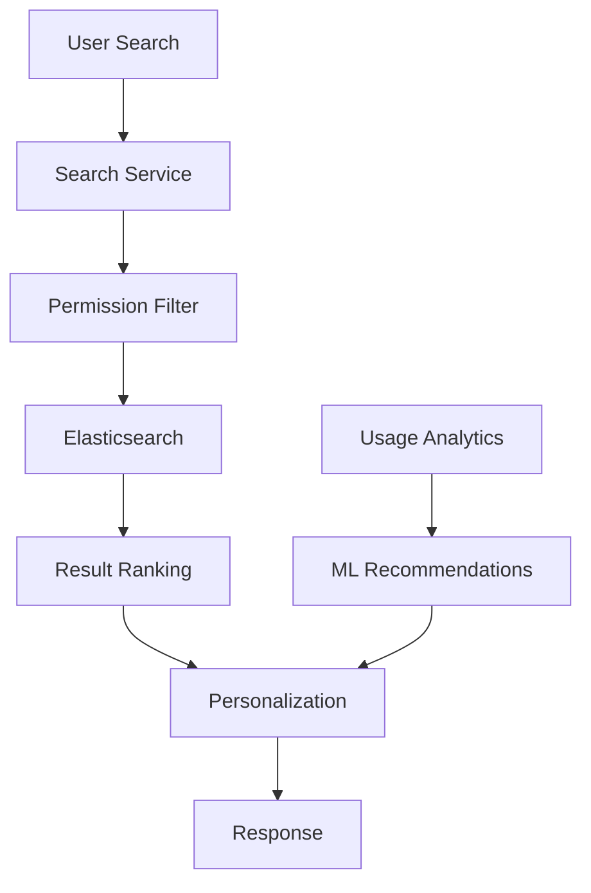
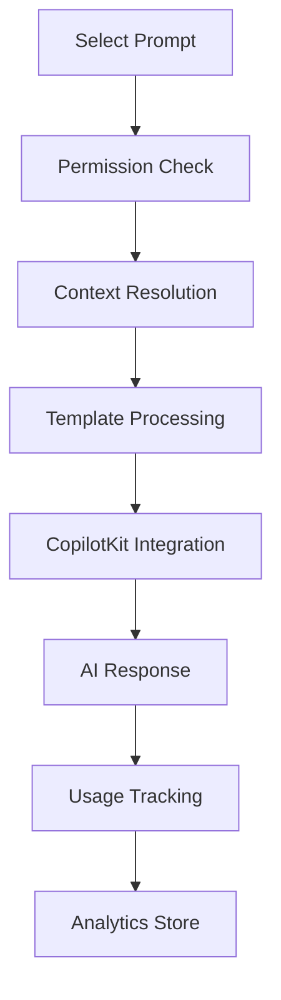

# Prompt Library - Product Requirements Document

## Executive Summary

The Prompt Library is a searchable, version-controlled repository of proven AI prompts designed to accelerate user productivity and ensure consistent, high-quality AI interactions. This feature transforms LeaderForge from a training platform into a comprehensive AI-powered productivity ecosystem with monetizable content and community-driven growth.

## Document Information

- **Document Version**: 1.0
- **Last Updated**: [Current Date]
- **Author**: [Glen Hobbs]
- **Status**: Draft
- **Target Release**: Q2 2025

---

## Table of Contents

1. [Product Overview](#product-overview)
2. [User Personas & Access Scenarios](#user-personas--access-scenarios)
3. [Role-Based Access Control (RBAC)](#role-based-access-control-rbac)
4. [Functional Requirements](#functional-requirements)
5. [Technical Architecture](#technical-architecture)
6. [Database Schema](#database-schema)
7. [API Specifications](#api-specifications)
8. [Security & Privacy](#security--privacy)
9. [Integration Requirements](#integration-requirements)
10. [Success Metrics](#success-metrics)
11. [Implementation Timeline](#implementation-timeline)

---

## Product Overview

### Purpose Statement
The Prompt Library enables users to discover, use, and contribute proven AI prompts for specific business scenarios, creating a scalable knowledge base that improves over time through community contributions and usage analytics.

### Core Value Propositions
- **Accelerated Productivity**: Users find proven prompts instead of creating from scratch
- **Consistent Quality**: Version-controlled, tested prompts ensure reliable outcomes
- **Community Learning**: Shared knowledge accelerates everyone's AI proficiency
- **Revenue Generation**: Premium prompts and advanced features drive subscription revenue

### Key Features
- Searchable prompt repository with advanced filtering
- Version control and usage analytics
- Community contributions with moderation workflows
- Integration with CopilotKit for seamless execution
- Role-based access control with entitlement management
- Premium content and licensing models

---

## User Personas & Access Scenarios

### Primary Personas

#### 1. **Executive User** (CEO, CTO, Department Heads)
**Access Needs**: Full access to all premium content, ability to create private prompts, view team usage analytics
**Use Cases**: Strategic planning prompts, leadership frameworks, confidential scenario planning
**Pain Points**: Need high-quality, executive-level prompts that reflect organizational values

#### 2. **Team Leader** (Managers, Team Leads, Project Managers)
**Access Needs**: Team-level prompts, ability to create team-private prompts, moderate team contributions
**Use Cases**: Team management, performance reviews, project planning, conflict resolution
**Pain Points**: Need prompts that work for their specific team dynamics and organizational context

#### 3. **Individual Contributor** (Employees, Specialists)
**Access Needs**: Personal prompts, community contributions, basic prompt library access
**Use Cases**: Daily productivity, skill development, professional communication, task automation
**Pain Points**: Need relevant prompts for their role without overwhelming choice

#### 4. **Community Contributor** (Power Users, External Experts)
**Access Needs**: Ability to submit, edit, and moderate community prompts
**Use Cases**: Share expertise, build reputation, contribute to platform growth
**Pain Points**: Need clear guidelines and fair recognition for contributions

#### 5. **System Administrator** (IT, Platform Admins)
**Access Needs**: Full administrative control, usage monitoring, security oversight
**Use Cases**: User management, content moderation, security monitoring, compliance
**Pain Points**: Need comprehensive admin tools and clear audit trails

### Access Scenarios

#### Scenario 1: New User Onboarding
```
User: New Individual Contributor
Action: First login to Prompt Library
Expected Behavior: 
- See featured prompts relevant to their role
- Access to basic prompts included in their plan
- Guided tour of search and filtering features
- Prompt to complete profile for better recommendations
```

#### Scenario 2: Team Collaboration
```
User: Team Leader creating team-specific prompt
Action: Create new prompt marked as "Team Private"
Expected Behavior:
- Only team members can see and use the prompt
- Team leader can edit permissions
- Usage tracked at team level
- Can later promote to organization-wide if desired
```

#### Scenario 3: Premium Content Access
```
User: Individual Contributor on Basic Plan
Action: Attempts to access Executive-level prompt
Expected Behavior:
- See prompt preview with limited details
- Clear upgrade path to access full content
- Option to request team/org upgrade
- Alternative free prompts suggested
```

---

## Role-Based Access Control (RBAC)

### Permission Matrix

| Feature | Guest | Individual | Team Member | Team Leader | Executive | Admin | Community Mod |
|---------|--------|------------|-------------|-------------|-----------|--------|---------------|
| **VIEW PROMPTS** | | | | | | | |
| Public prompts | ✅ | ✅ | ✅ | ✅ | ✅ | ✅ | ✅ |
| Team prompts | ❌ | ❌ | ✅ | ✅ | ✅ | ✅ | ✅ |
| Organization prompts | ❌ | ❌ | ✅ | ✅ | ✅ | ✅ | ✅ |
| Premium prompts | ❌ | Plan-based | Plan-based | Plan-based | ✅ | ✅ | Plan-based |
| Private prompts | ❌ | Own only | Own only | Own + Team | Own + Team | All | Community only |
| **CREATE PROMPTS** | | | | | | | |
| Personal prompts | ❌ | ✅ | ✅ | ✅ | ✅ | ✅ | ✅ |
| Team prompts | ❌ | ❌ | ✅ | ✅ | ✅ | ✅ | ❌ |
| Organization prompts | ❌ | ❌ | ❌ | ❌ | ✅ | ✅ | ❌ |
| Community submissions | ❌ | ✅ | ✅ | ✅ | ✅ | ✅ | ✅ |
| **EDIT PROMPTS** | | | | | | | |
| Own prompts | ❌ | ✅ | ✅ | ✅ | ✅ | ✅ | ✅ |
| Team prompts | ❌ | ❌ | ❌ | ✅ | ✅ | ✅ | ❌ |
| Organization prompts | ❌ | ❌ | ❌ | ❌ | ✅ | ✅ | ❌ |
| Community prompts | ❌ | ❌ | ❌ | ❌ | ❌ | ✅ | ✅ |
| **ADMIN FUNCTIONS** | | | | | | | |
| View usage analytics | ❌ | Own only | Own only | Team data | Org data | All data | Community data |
| Moderate submissions | ❌ | ❌ | ❌ | ❌ | ❌ | ✅ | ✅ |
| Manage users | ❌ | ❌ | ❌ | ❌ | ❌ | ✅ | ❌ |
| Export data | ❌ | Own only | Own only | Team data | Org data | All data | ❌ |

### Entitlement Integration Points

#### Plan-Based Access Control
```typescript
interface PromptLibraryEntitlements {
  planTier: 'starter' | 'professional' | 'enterprise' | 'custom';
  maxPersonalPrompts: number;
  maxTeamPrompts: number;
  premiumContentAccess: boolean;
  advancedAnalytics: boolean;
  communitySubmissions: boolean;
  customCategories: boolean;
  apiAccess: boolean;
  bulkImport: boolean;
}
```

#### Role-Based Permissions
```typescript
interface UserPermissions {
  userId: string;
  organizationId: string;
  roleId: string;
  permissions: {
    canViewPrompts: PromptVisibilityLevel[];
    canCreatePrompts: PromptVisibilityLevel[];
    canEditPrompts: PromptVisibilityLevel[];
    canDeletePrompts: PromptVisibilityLevel[];
    canModerateSubmissions: boolean;
    canViewAnalytics: AnalyticsScope;
    maxPromptCreations: number;
  };
}
```

### Access Control Rules

#### Prompt Visibility Levels
1. **Public**: Available to all users regardless of plan
2. **Community**: Available to users with community access
3. **Team**: Restricted to specific team members
4. **Organization**: Available to all organization members
5. **Premium**: Requires premium subscription
6. **Private**: Creator and explicitly granted users only

#### Dynamic Permission Resolution
```typescript
function canAccessPrompt(user: User, prompt: Prompt): boolean {
  // Check plan entitlements
  if (prompt.isPremium && !user.entitlements.premiumContentAccess) {
    return false;
  }
  
  // Check role-based permissions
  if (prompt.visibilityLevel === 'team' && !user.teams.includes(prompt.teamId)) {
    return false;
  }
  
  // Check organization membership
  if (prompt.visibilityLevel === 'organization' && user.organizationId !== prompt.organizationId) {
    return false;
  }
  
  // Check explicit grants for private prompts
  if (prompt.visibilityLevel === 'private') {
    return prompt.creatorId === user.id || prompt.explicitGrants.includes(user.id);
  }
  
  return true;
}
```

---

## Functional Requirements

### Core Features

#### 1. Prompt Discovery & Search

**FR-001: Advanced Search Interface**
- Full-text search across prompt title, description, and content
- Filter by category, tags, difficulty level, usage count
- Sort by relevance, popularity, creation date, rating
- Saved searches and search history
- Real-time search suggestions

**FR-002: Categorization System**
- Hierarchical category structure (Business > Leadership > Team Management)
- Multi-tag support with tag auto-completion
- Smart categorization suggestions based on content analysis
- Custom categories for enterprise users

**FR-003: Content Discovery**
- Personalized recommendations based on user behavior
- Trending prompts section
- Recently used prompts
- Related prompts suggestions
- Featured prompts curated by community moderators

#### 2. Prompt Management

**FR-004: Prompt Creation & Editing**
- Rich text editor with markdown support
- Template variables and placeholders
- Prompt preview functionality
- Multi-language support
- Instructions and usage examples

**FR-005: Version Control**
- Track all prompt modifications with timestamps
- Compare versions side-by-side
- Revert to previous versions
- Fork existing prompts to create variations
- Merge conflict resolution for collaborative editing

**FR-006: Quality Assurance**
- Prompt validation rules (minimum length, required fields)
- AI-powered quality scoring
- Peer review workflow for community submissions
- Automated duplicate detection
- Content moderation queue

#### 3. Community Features

**FR-007: User Contributions**
- Submit new prompts with attribution
- Edit existing community prompts (with approval)
- Comment and rate prompts
- Report inappropriate content
- Contributor reputation system

**FR-008: Collaboration Tools**
- Share prompts via link with permissions
- Collaborate on prompt development
- Team prompt libraries
- Discussion threads for prompt improvement
- Change requests and approval workflows

#### 4. Usage Analytics

**FR-009: Usage Tracking**
- Track prompt usage frequency and success rates
- User behavior analytics (search patterns, popular categories)
- A/B testing for prompt effectiveness
- Performance metrics for AI responses
- ROI measurement for premium prompts

**FR-010: Reporting Dashboard**
- Personal usage statistics
- Team performance metrics
- Organization-wide analytics
- Custom report generation
- Data export capabilities

### Integration Features

#### 5. CopilotKit Integration

**FR-011: Seamless Execution**
- One-click prompt execution in CopilotKit
- Pre-populate template variables with user context
- Maintain conversation history across prompt usage
- Save customized prompt variations
- Quick access to recently used prompts

**FR-012: Context Inheritance**
- Apply user's active prompt contexts automatically
- Preview how contexts will affect prompt execution
- Option to temporarily disable contexts for specific prompts
- Context-aware prompt recommendations
- Smart prompt modification based on active contexts

#### 6. External Integrations

**FR-013: Third-Party Prompt Sources**
- Import prompts from external libraries
- Sync with industry-standard prompt repositories
- API access for custom integrations
- Webhook support for real-time updates
- Export prompts to external tools

**FR-014: Workflow Integration**
- Integration with project management tools
- Calendar integration for scheduled prompt execution
- Email integration for prompt sharing
- Slack/Teams integration for team collaboration
- Documentation system integration

---

## Technical Architecture

### System Components

#### Frontend Architecture
```typescript
interface PromptLibraryFrontend {
  components: {
    SearchInterface: React.Component;
    PromptCard: React.Component;
    PromptEditor: React.Component;
    CategoryBrowser: React.Component;
    UserDashboard: React.Component;
    AdminPanel: React.Component;
  };
  
  services: {
    SearchService: SearchAPI;
    PromptService: PromptCRUD;
    UserService: UserManagement;
    AnalyticsService: UsageTracking;
  };
  
  stores: {
    PromptStore: StateManager;
    UserStore: StateManager;
    UIStore: StateManager;
  };
}
```

#### Backend Architecture
```typescript
interface PromptLibraryBackend {
  apis: {
    PromptAPI: RestAPI;
    SearchAPI: ElasticsearchAPI;
    AnalyticsAPI: AnalyticsEngine;
    EntitlementAPI: PermissionManager;
  };
  
  services: {
    PromptService: BusinessLogic;
    SearchService: SearchEngine;
    VersioningService: GitLikeVersioning;
    ModerationService: ContentModeration;
    NotificationService: EventPublisher;
  };
  
  storage: {
    PromptDatabase: PostgreSQL;
    SearchIndex: Elasticsearch;
    FileStorage: S3Compatible;
    Cache: Redis;
  };
}
```

### Data Flow Architecture

#### Search & Discovery Flow


#### Prompt Execution Flow


### Scalability Considerations

#### Horizontal Scaling
- Microservices architecture with independent scaling
- Load balancer distribution across multiple API instances
- Database read replicas for improved performance
- CDN for static assets and frequently accessed prompts

#### Performance Optimization
- Elasticsearch for fast full-text search
- Redis caching for frequently accessed prompts
- Lazy loading for prompt content
- Pagination and virtual scrolling for large result sets

#### Data Architecture
- Event-driven architecture for real-time updates
- CQRS pattern for read/write optimization
- Message queues for asynchronous processing
- Data partitioning by organization for isolation

---

## Database Schema

### Core Tables

#### Prompts Table
```sql
CREATE TABLE prompts (
    id UUID PRIMARY KEY,
    title VARCHAR(255) NOT NULL,
    description TEXT,
    content TEXT NOT NULL,
    instructions TEXT,
    category_id UUID REFERENCES categories(id),
    creator_id UUID REFERENCES users(id),
    organization_id UUID REFERENCES organizations(id),
    team_id UUID REFERENCES teams(id),
    visibility_level VARCHAR(20) NOT NULL CHECK (visibility_level IN ('public', 'community', 'team', 'organization', 'premium', 'private')),
    is_premium BOOLEAN DEFAULT FALSE,
    is_featured BOOLEAN DEFAULT FALSE,
    version INTEGER NOT NULL DEFAULT 1,
    parent_prompt_id UUID REFERENCES prompts(id),
    status VARCHAR(20) DEFAULT 'active' CHECK (status IN ('draft', 'active', 'archived', 'deleted')),
    moderation_status VARCHAR(20) DEFAULT 'pending' CHECK (moderation_status IN ('pending', 'approved', 'rejected')),
    usage_count INTEGER DEFAULT 0,
    rating_average DECIMAL(3,2) DEFAULT 0,
    rating_count INTEGER DEFAULT 0,
    created_at TIMESTAMP DEFAULT NOW(),
    updated_at TIMESTAMP DEFAULT NOW(),
    created_by UUID REFERENCES users(id),
    updated_by UUID REFERENCES users(id)
);

CREATE INDEX idx_prompts_visibility ON prompts(visibility_level);
CREATE INDEX idx_prompts_category ON prompts(category_id);
CREATE INDEX idx_prompts_organization ON prompts(organization_id);
CREATE INDEX idx_prompts_creator ON prompts(creator_id);
CREATE INDEX idx_prompts_usage_count ON prompts(usage_count DESC);
CREATE INDEX idx_prompts_rating ON prompts(rating_average DESC);
```

#### Categories Table
```sql
CREATE TABLE categories (
    id UUID PRIMARY KEY,
    name VARCHAR(100) NOT NULL,
    description TEXT,
    parent_id UUID REFERENCES categories(id),
    organization_id UUID REFERENCES organizations(id),
    is_system_category BOOLEAN DEFAULT FALSE,
    sort_order INTEGER DEFAULT 0,
    created_at TIMESTAMP DEFAULT NOW(),
    updated_at TIMESTAMP DEFAULT NOW()
);

CREATE INDEX idx_categories_parent ON categories(parent_id);
CREATE INDEX idx_categories_organization ON categories(organization_id);
```

#### Tags Table
```sql
CREATE TABLE tags (
    id UUID PRIMARY KEY,
    name VARCHAR(50) NOT NULL,
    color VARCHAR(7), -- Hex color code
    organization_id UUID REFERENCES organizations(id),
    usage_count INTEGER DEFAULT 0,
    created_at TIMESTAMP DEFAULT NOW()
);

CREATE INDEX idx_tags_name ON tags(name);
CREATE INDEX idx_tags_organization ON tags(organization_id);
```

#### Prompt Tags Junction Table
```sql
CREATE TABLE prompt_tags (
    prompt_id UUID REFERENCES prompts(id) ON DELETE CASCADE,
    tag_id UUID REFERENCES tags(id) ON DELETE CASCADE,
    created_at TIMESTAMP DEFAULT NOW(),
    PRIMARY KEY (prompt_id, tag_id)
);
```

### Access Control Tables

#### Prompt Permissions Table
```sql
CREATE TABLE prompt_permissions (
    id UUID PRIMARY KEY,
    prompt_id UUID REFERENCES prompts(id) ON DELETE CASCADE,
    user_id UUID REFERENCES users(id) ON DELETE CASCADE,
    team_id UUID REFERENCES teams(id) ON DELETE CASCADE,
    role_id UUID REFERENCES roles(id) ON DELETE CASCADE,
    permission_type VARCHAR(20) NOT NULL CHECK (permission_type IN ('read', 'write', 'admin')),
    granted_by UUID REFERENCES users(id),
    granted_at TIMESTAMP DEFAULT NOW(),
    expires_at TIMESTAMP
);

CREATE INDEX idx_prompt_permissions_prompt ON prompt_permissions(prompt_id);
CREATE INDEX idx_prompt_permissions_user ON prompt_permissions(user_id);
CREATE INDEX idx_prompt_permissions_team ON prompt_permissions(team_id);
```

#### User Entitlements Table
```sql
CREATE TABLE user_entitlements (
    id UUID PRIMARY KEY,
    user_id UUID REFERENCES users(id) ON DELETE CASCADE,
    organization_id UUID REFERENCES organizations(id),
    plan_tier VARCHAR(20) NOT NULL,
    max_personal_prompts INTEGER,
    max_team_prompts INTEGER,
    premium_content_access BOOLEAN DEFAULT FALSE,
    advanced_analytics BOOLEAN DEFAULT FALSE,
    community_submissions BOOLEAN DEFAULT FALSE,
    custom_categories BOOLEAN DEFAULT FALSE,
    api_access BOOLEAN DEFAULT FALSE,
    bulk_import BOOLEAN DEFAULT FALSE,
    created_at TIMESTAMP DEFAULT NOW(),
    updated_at TIMESTAMP DEFAULT NOW(),
    expires_at TIMESTAMP
);

CREATE INDEX idx_user_entitlements_user ON user_entitlements(user_id);
CREATE INDEX idx_user_entitlements_organization ON user_entitlements(organization_id);
```

### Analytics Tables

#### Prompt Usage Table
```sql
CREATE TABLE prompt_usage (
    id UUID PRIMARY KEY,
    prompt_id UUID REFERENCES prompts(id),
    user_id UUID REFERENCES users(id),
    organization_id UUID REFERENCES organizations(id),
    execution_context JSONB, -- CopilotKit context data
    success_rating INTEGER CHECK (success_rating BETWEEN 1 AND 5),
    execution_time_ms INTEGER,
    created_at TIMESTAMP DEFAULT NOW()
);

CREATE INDEX idx_prompt_usage_prompt ON prompt_usage(prompt_id);
CREATE INDEX idx_prompt_usage_user ON prompt_usage(user_id);
CREATE INDEX idx_prompt_usage_created_at ON prompt_usage(created_at);
```

#### Search Analytics Table
```sql
CREATE TABLE search_analytics (
    id UUID PRIMARY KEY,
    user_id UUID REFERENCES users(id),
    organization_id UUID REFERENCES organizations(id),
    search_query TEXT,
    filters_applied JSONB,
    results_count INTEGER,
    selected_result_position INTEGER,
    selected_prompt_id UUID REFERENCES prompts(id),
    session_id VARCHAR(255),
    created_at TIMESTAMP DEFAULT NOW()
);

CREATE INDEX idx_search_analytics_user ON search_analytics(user_id);
CREATE INDEX idx_search_analytics_created_at ON search_analytics(created_at);
```

### Version Control Tables

#### Prompt Versions Table
```sql
CREATE TABLE prompt_versions (
    id UUID PRIMARY KEY,
    prompt_id UUID REFERENCES prompts(id) ON DELETE CASCADE,
    version_number INTEGER NOT NULL,
    title VARCHAR(255) NOT NULL,
    description TEXT,
    content TEXT NOT NULL,
    instructions TEXT,
    change_summary TEXT,
    created_by UUID REFERENCES users(id),
    created_at TIMESTAMP DEFAULT NOW(),
    UNIQUE(prompt_id, version_number)
);

CREATE INDEX idx_prompt_versions_prompt ON prompt_versions(prompt_id);
CREATE INDEX idx_prompt_versions_created_at ON prompt_versions(created_at);
```

---

## API Specifications

### REST API Endpoints

#### Prompt Management API

```typescript
// GET /api/prompts
interface GetPromptsRequest {
  search?: string;
  category?: string;
  tags?: string[];
  visibility?: VisibilityLevel;
  page?: number;
  limit?: number;
  sort?: 'relevance' | 'popularity' | 'recent' | 'rating';
}

interface GetPromptsResponse {
  prompts: Prompt[];
  totalCount: number;
  page: number;
  hasNext: boolean;
  filters: {
    categories: Category[];
    tags: Tag[];
  };
}

// GET /api/prompts/{id}
interface GetPromptResponse {
  prompt: Prompt;
  permissions: UserPermissions;
  usage: UsageStats;
  versions: PromptVersion[];
}

// POST /api/prompts
interface CreatePromptRequest {
  title: string;
  description?: string;
  content: string;
  instructions?: string;
  categoryId?: string;
  tags?: string[];
  visibilityLevel: VisibilityLevel;
  teamId?: string;
}

interface CreatePromptResponse {
  prompt: Prompt;
  success: boolean;
  errors?: ValidationError[];
}

// PUT /api/prompts/{id}
interface UpdatePromptRequest {
  title?: string;
  description?: string;
  content?: string;
  instructions?: string;
  categoryId?: string;
  tags?: string[];
  changeSummary?: string;
}

// DELETE /api/prompts/{id}
interface DeletePromptResponse {
  success: boolean;
  message: string;
}
```

#### Search API

```typescript
// POST /api/search/prompts
interface SearchPromptsRequest {
  query: string;
  filters: {
    categories?: string[];
    tags?: string[];
    visibility?: VisibilityLevel[];
    isPremium?: boolean;
    minRating?: number;
    dateRange?: {
      from: string;
      to: string;
    };
  };
  sort: SearchSort;
  page: number;
  limit: number;
}

interface SearchPromptsResponse {
  results: SearchResult[];
  totalCount: number;
  aggregations: {
    categories: CategoryAggregation[];
    tags: TagAggregation[];
    ratings: RatingDistribution;
  };
  suggestions: string[];
  queryId: string; // For analytics tracking
}

interface SearchResult {
  prompt: Prompt;
  score: number;
  highlights: {
    title?: string[];
    description?: string[];
    content?: string[];
  };
}
```

#### Analytics API

```typescript
// GET /api/analytics/prompts/{id}/usage
interface PromptUsageAnalyticsResponse {
  promptId: string;
  totalUsages: number;
  uniqueUsers: number;
  averageRating: number;
  usageOverTime: TimeSeriesData[];
  topUsers: UserUsageData[];
  successRate: number;
}

// POST /api/analytics/usage
interface TrackUsageRequest {
  promptId: string;
  executionContext: any;
  successRating?: number;
  executionTimeMs: number;
  sessionId: string;
}

// GET /api/analytics/dashboard
interface AnalyticsDashboardResponse {
  personalStats: PersonalUsageStats;
  teamStats?: TeamUsageStats;
  organizationStats?: OrganizationUsageStats;
  recommendations: PromptRecommendation[];
}
```

#### Permissions API

```typescript
// GET /api/prompts/{id}/permissions
interface GetPermissionsResponse {
  promptId: string;
  isOwner: boolean;
  permissions: {
    canRead: boolean;
    canEdit: boolean;
    canDelete: boolean;
    canShare: boolean;
    canModerate: boolean;
  };
  explicitGrants: UserPermissionGrant[];
}

// POST /api/prompts/{id}/permissions
interface GrantPermissionRequest {
  userId?: string;
  teamId?: string;
  roleId?: string;
  permissionType: 'read' | 'write' | 'admin';
  expiresAt?: string;
}

// GET /api/users/entitlements
interface GetEntitlementsResponse {
  userId: string;
  planTier: PlanTier;
  entitlements: UserEntitlements;
  usage: {
    personalPrompts: number;
    teamPrompts: number;
    monthlyUsage: number;
  };
  limits: EntitlementLimits;
}
```

### GraphQL Schema

```graphql
type Prompt {
  id: ID!
  title: String!
  description: String
  content: String!
  instructions: String
  category: Category
  tags: [Tag!]!
  creator: User!
  organization: Organization
  team: Team
  visibilityLevel: VisibilityLevel!
  isPremium: Boolean!
  isFeatured: Boolean!
  version: Int!
  parentPrompt: Prompt
  status: PromptStatus!
  moderationStatus: ModerationStatus!
  usageCount: Int!
  ratingAverage: Float!
  ratingCount: Int!
  createdAt: DateTime!
  updatedAt: DateTime!
  
  # Computed fields
  permissions: PromptPermissions!
  canEdit: Boolean!
  canDelete: Boolean!
  versions: [PromptVersion!]!
  usage: PromptUsageStats!
}

type Query {
  prompts(
    search: String
    filters: PromptFilters
    sort: PromptSort
    page: Int = 1
    limit: Int = 20
  ): PromptConnection!
  
  prompt(id: ID!): Prompt
  
  searchPrompts(
    query: String!
    filters: SearchFilters
  ): SearchResults!
  
  myPrompts: [Prompt!]!
  teamPrompts(teamId: ID!): [Prompt!]!
  organizationPrompts: [Prompt!]!
  
  promptCategories: [Category!]!
  promptTags: [Tag!]!
  
  userEntitlements: UserEntitlements!
}

type Mutation {
  createPrompt(input: CreatePromptInput!): CreatePromptPayload!
  updatePrompt(id: ID!, input: UpdatePromptInput!): UpdatePromptPayload!
  deletePrompt(id: ID!): DeletePromptPayload!
  
  forkPrompt(id: ID!, input: ForkPromptInput!): CreatePromptPayload!
  
  ratePrompt(id: ID!, rating: Int!): RatePromptPayload!
  
  grantPromptPermission(input: GrantPermissionInput!): GrantPermissionPayload!
  revokePromptPermission(input: RevokePermissionInput!): RevokePermissionPayload!
  
  trackPromptUsage(input: TrackUsageInput!): TrackUsagePayload!
}

type Subscription {
  promptUpdated(id: ID!): Prompt!
  newPromptsInCategory(categoryId: ID!): Prompt!
  teamPromptActivity(teamId: ID!): PromptActivity!
}
```

---

## Security & Privacy

### Authentication & Authorization

#### Authentication Requirements
- OAuth 2.0 / OpenID Connect integration
- Multi-factor authentication support
- SSO integration for enterprise customers
- Session management with secure tokens
- API key authentication for programmatic access

#### Authorization Framework
```typescript
interface SecurityContext {
  user: AuthenticatedUser;
  organization: Organization;
  permissions: Permission[];
  entitlements: Entitlement[];
  sessionId: string;
}

interface Permission {
  resource: string; // prompt:123, category:456
  action: string;   // read, write, delete, admin
  scope: string;    // own, team, organization, all
  conditions?: PermissionCondition[];
}
```

### Data Protection

#### Encryption
- **Data at Rest**: AES-256 encryption for sensitive prompt content
- **Data in Transit**: TLS 1.3 for all API communications
- **API Keys**: Hashed and salted storage
- **PII Data**: Encrypted fields for user information

#### Privacy Controls
- **Data Minimization**: Collect only necessary user data
- **Purpose Limitation**: Use data only for stated purposes
- **Data Retention**: Configurable retention policies
- **Right to Delete**: Complete data removal on request
- **Data Portability**: Export user data in standard formats

#### Audit & Compliance
```sql
CREATE TABLE audit_logs (
    id UUID PRIMARY KEY,
    user_id UUID REFERENCES users(id),
    organization_id UUID REFERENCES organizations(id),
    action VARCHAR(50) NOT NULL,
    resource_type VARCHAR(50) NOT NULL,
    resource_id UUID,
    old_values JSONB,
    new_values JSONB,
    ip_address INET,
    user_agent TEXT,
    created_at TIMESTAMP DEFAULT NOW()
);
```

### Content Security

#### Input Validation
- **Prompt Content**: Sanitize HTML, validate length limits
- **Search Queries**: Prevent injection attacks
- **File Uploads**: Virus scanning, file type validation
- **User Input**: XSS prevention, CSRF protection

#### Content Moderation
```typescript
interface ModerationWorkflow {
  automaticScanning: {
    harmfulContent: boolean;
    spamDetection: boolean;
    duplicateDetection: boolean;
    qualityScoring: boolean;
  };
  
  humanReview: {
    communityFlagging: boolean;
    moderatorQueue: boolean;
    escalationRules: ModerationRule[];
  };
  
  actions: {
    autoApprove: ModerationCriteria;
    requireReview: ModerationCriteria;
    autoReject: ModerationCriteria;
  };
}
```

---

## Integration Requirements

### Entitlement Management Integration

#### Plan-Based Entitlements
```typescript
interface EntitlementChecks {
  // Check if user can create more prompts
  canCreatePrompt(userId: string, visibilityLevel: VisibilityLevel): Promise<{
    allowed: boolean;
    reason?: string;
    upgradeRequired?: PlanTier;
  }>;
  
  // Check access to premium content
  canAccessPremiumContent(userId: string): Promise<boolean>;
  
  // Check feature availability
  hasFeatureAccess(userId: string, feature: Feature): Promise<boolean>;
  
  // Get usage limits
  getUsageLimits(userId: string): Promise<UsageLimits>;
  
  // Track usage for billing
  trackUsage(userId: string, usageType: UsageType): Promise<void>;
}
```

#### Subscription Management
```typescript
interface SubscriptionEvents {
  onPlanUpgrade: (userId: string, newPlan: PlanTier) => void;
  onPlanDowngrade: (userId: string, newPlan: PlanTier) => void;
  onSubscriptionCancellation: (userId: string) => void;
  onTrialStart: (userId: string, trialPlan: PlanTier) => void;
  onTrialEnd: (userId: string) => void;
}
```

### CopilotKit Integration

#### Prompt Execution
```typescript
interface CopilotKitIntegration {
  // Execute prompt with context
  executePrompt(
    promptId: string,
    context: PromptContext,
    userContexts: UserContext[]
  ): Promise<CopilotResponse>;
  
  // Pre-populate prompt template
  populateTemplate(
    promptContent: string,
    variables: TemplateVariables
  ): string;
  
  // Track execution results
  trackExecution(
    promptId: string,
    executionId: string,
    success: boolean,
    metrics: ExecutionMetrics
  ): void;
}
```

#### Context Integration
```typescript
interface PromptContextIntegration {
  // Get applicable contexts for prompt
  getApplicableContexts(
    userId: string,
    promptId: string
  ): Promise<PromptContext[]>;
  
  // Preview prompt with contexts
  previewWithContexts(
    promptContent: string,
    contexts: PromptContext[]
  ): Promise<string>;
}
```

### External Integrations

#### Analytics Integration
```typescript
interface AnalyticsIntegration {
  // Track user behavior
  trackEvent(event: AnalyticsEvent): void;
  
  // Track business metrics
  trackConversion(userId: string, conversionType: string): void;
  
  // Track performance metrics
  trackPerformance(metric: PerformanceMetric): void;
}
```

#### Notification Integration
```typescript
interface NotificationIntegration {
  // Send notifications
  sendNotification(
    userId: string,
    notification: Notification
  ): Promise<void>;
  
  // Manage notification preferences
  updatePreferences(
    userId: string,
    preferences: NotificationPreferences
  ): Promise<void>;
}
```

---

## Success Metrics

### User Engagement Metrics

#### Primary KPIs
- **Daily Active Users (DAU)**: Users who interact with the prompt library daily
- **Prompt Usage Rate**: Average prompts used per user per session
- **Search Success Rate**: Percentage of searches resulting in prompt selection
- **User Retention**: 7-day, 30-day, and 90-day retention rates
- **Feature Adoption**: Percentage of users using advanced features

#### Secondary KPIs
- **Content Creation Rate**: New prompts created per user per month
- **Community Engagement**: Comments, ratings, and shares per prompt
- **Search Efficiency**: Average time from search to prompt selection
- **Return Usage**: Percentage of users who reuse prompts
- **Cross-Feature Usage**: Users who use both library and CopilotKit

### Business Impact Metrics

#### Revenue Metrics
- **Premium Conversion Rate**: Free to paid plan conversion
- **Revenue Per User (RPU)**: Average monthly revenue per user
- **Lifetime Value (LTV)**: Customer lifetime value
- **Churn Rate**: Monthly subscription cancellation rate
- **Upgrade Rate**: Users upgrading to higher-tier plans

#### Content Quality Metrics
- **Prompt Rating Average**: Average user rating across all prompts
- **Usage-to-Rating Correlation**: Relationship between usage and ratings
- **Content Freshness**: Percentage of recently updated prompts
- **Moderation Efficiency**: Time from submission to approval
- **Duplicate Rate**: Percentage of submitted prompts that are duplicates

### Technical Performance Metrics

#### System Performance
- **Search Response Time**: Average time for search results (target: <200ms)
- **Prompt Load Time**: Time to display prompt details (target: <100ms)
- **API Response Time**: Average API response time (target: <500ms)
- **System Uptime**: Service availability (target: 99.9%)
- **Error Rate**: Percentage of failed requests (target: <0.1%)

#### Scalability Metrics
- **Concurrent Users**: Maximum simultaneous users supported
- **Search Throughput**: Searches per second capacity
- **Database Performance**: Query execution time
- **Cache Hit Rate**: Percentage of requests served from cache
- **Storage Growth**: Rate of data storage increase

### Success Criteria by Phase

#### Phase 1 (MVP) - Months 1-3
- ✅ 500+ high-quality prompts in library
- ✅ 80% search success rate
- ✅ 50+ daily active users
- ✅ <200ms average search response time
- ✅ Basic RBAC implementation

#### Phase 2 (Growth) - Months 4-6
- ✅ 2,000+ prompts across 20+ categories
- ✅ 85% search success rate
- ✅ 200+ daily active users
- ✅ 20% premium conversion rate
- ✅ Community contribution system

#### Phase 3 (Scale) - Months 7-12
- ✅ 10,000+ prompts
- ✅ 90% search success rate
- ✅ 1,000+ daily active users
- ✅ 30% premium conversion rate
- ✅ Advanced analytics and AI recommendations

---

## Implementation Timeline

### Phase 1: Foundation (Months 1-3)

#### Month 1: Core Infrastructure
**Week 1-2**: Architecture setup and database design
- Set up development environment
- Create database schema
- Implement basic authentication
- Set up CI/CD pipeline

**Week 3-4**: Basic CRUD operations
- Implement prompt creation/editing
- Basic search functionality
- Category management
- User permission framework

#### Month 2: Search & Discovery
**Week 5-6**: Advanced search implementation
- Elasticsearch integration
- Advanced filtering system
- Search analytics
- Performance optimization

**Week 7-8**: User interface development
- React components for search
- Prompt detail views
- Category browser
- User dashboard

#### Month 3: Basic Features
**Week 9-10**: Version control system
- Prompt versioning
- Change tracking
- Comparison tools
- Rollback functionality

**Week 11-12**: Basic access control
- Role-based permissions
- Team/organization isolation
- Basic entitlement checks
- Security testing

### Phase 2: Core Features (Months 4-6)

#### Month 4: Community Features
**Week 13-14**: User contributions
- Community submission workflow
- Rating and review system
- User reputation tracking
- Content moderation tools

**Week 15-16**: Collaboration tools
- Prompt sharing
- Team libraries
- Discussion system
- Workflow approvals

#### Month 5: CopilotKit Integration
**Week 17-18**: Execution integration
- Seamless prompt launching
- Context inheritance
- Template processing
- Usage tracking

**Week 19-20**: Advanced workflows
- Prompt customization
- Execution history
- Success tracking
- Performance analytics

#### Month 6: Analytics & Optimization
**Week 21-22**: Analytics implementation
- Usage tracking
- Performance metrics
- User behavior analysis
- Business intelligence

**Week 23-24**: AI recommendations
- Personalization engine
- Smart suggestions
- Predictive analytics
- A/B testing framework

### Phase 3: Advanced Features (Months 7-12)

#### Months 7-8: Premium Features
- Advanced entitlement management
- Premium content system
- Enterprise features
- Custom branding

#### Months 9-10: Integration Expansion
- External API integrations
- Webhook system
- Third-party prompt sources
- Advanced import/export

#### Months 11-12: Scale & Optimization
- Performance optimization
- Advanced caching
- Monitoring and alerting
- Documentation and training

### Development Resources

#### Team Requirements
- **Frontend Developer** (React/TypeScript): 1 FTE
- **Backend Developer** (Node.js/PostgreSQL): 1 FTE
- **DevOps Engineer**: 0.5 FTE
- **UX/UI Designer**: 0.5 FTE
- **Product Manager**: 0.25 FTE
- **QA Engineer**: 0.5 FTE

#### Technology Stack
- **Frontend**: React, TypeScript, Tailwind CSS
- **Backend**: Node.js, Express, TypeScript
- **Database**: PostgreSQL, Redis
- **Search**: Elasticsearch
- **Authentication**: Auth0/Supabase
- **Infrastructure**: AWS/Vercel
- **Monitoring**: DataDog/New Relic

#### Third-Party Services
- **Entitlement Management**: Integration with existing system
- **Analytics**: Mixpanel/Amplitude
- **Error Tracking**: Sentry
- **Performance Monitoring**: New Relic
- **Content Moderation**: AWS Comprehend

---

## Conclusion

The Prompt Library represents a foundational component of LeaderForge's AI Operating System, providing users with immediate value while creating sustainable revenue streams through premium content and advanced features. The comprehensive RBAC system ensures secure, scalable access control that integrates seamlessly with existing entitlement management systems.

Success depends on balancing user needs for quick access to proven prompts with business requirements for premium monetization and community growth. The phased implementation approach allows for iterative improvement based on user feedback while maintaining technical excellence and security standards.

Key success factors include:
- **User-Centric Design**: Intuitive search and discovery experience
- **Content Quality**: High-quality, proven prompts with clear usage instructions
- **Community Growth**: Active contributor community with proper incentives
- **Technical Excellence**: Fast, reliable, and secure platform
- **Business Model**: Clear value proposition for premium features

This PRD provides the foundation for building a world-class prompt library that will differentiate LeaderForge in the AI-powered leadership development market while creating substantial business value through improved user engagement and premium subscription revenue.

---

**Next Steps:**
1. Stakeholder review and approval
2. Technical architecture review
3. Resource allocation and team assignment
4. Development kickoff and sprint planning
5. Begin Phase 1 implementation